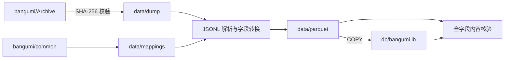
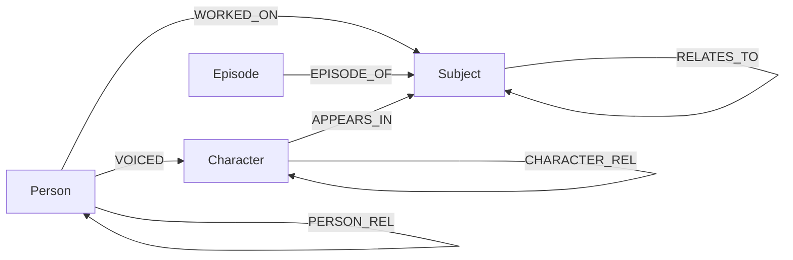

# 数据管道与图模型

本文说明如何将 [bangumi/Archive](https://github.com/bangumi/Archive)
的每周数据快照转换为可查询的 LadybugDB 图数据库。安装和查询方法见
[README](../README.md)，探索应用架构见
[EXPLORER_ARCHITECTURE.md](EXPLORER_ARCHITECTURE.md)。

| 项目 | 当前值 |
|---|---|
| 数据版本 | `dump-2026-07-28` |
| 数据库文件 | `db/bangumi.lb` |
| 节点 | 2,661,809 |
| 边 | 5,460,968 |
| 数据库大小 | 约 1.1 GB |

## 1. 架构概览

管道每周执行一次全量构建。Parquet 是源数据与数据库之间的稳定中间层，
LadybugDB 文件是最终查询产物。

设计目标：

- **保真**：保留已建模字段的原始值；重复主键保留首条，悬空关系不建边。
- **可验证**：源计数、悬空引用和全部表内容均由独立逻辑核验。
- **可复现**：数据版本随 Parquet 保存；复用中间产物时执行版本核对。
- **易部署**：数据库为单文件嵌入式产物，不依赖常驻服务。

## 2. 输入数据契约

### 2.1 数据文件

快照包含 9 个 JSON Lines 文件，压缩后约 406 MB，解压后约 1.78 GB。
`aux/latest.json` 提供下载地址和 SHA-256。上游通常在每周三更新。

实体文件：

| 文件 | 实体 | 当前规模 |
|---|---|---:|
| `subject` | 作品条目 | 669,977 |
| `person` | 人物或组织 | 98,818 |
| `character` | 角色 | 216,533 |
| `episode` | 分集 | 1,676,481 |

关联文件：

| 文件 | 关系 | 源数据规模 |
|---|---|---:|
| `subject-relations` | 作品之间的续集、改编等关系 | 约 91.6 万 |
| `subject-persons` | 人物参与作品 | 约 211 万 |
| `subject-characters` | 角色登场于作品 | 约 43.8 万 |
| `person-characters` | 人物在指定作品中为角色配音 | 约 28.1 万 |
| `person-relations` | 人物之间或角色之间的关系 | 约 7.1 万 |

以上规模用于说明数据量，不作为固定允许值。验证器会针对每个新快照重新计算
源行数、悬空引用和实际入库数。

### 2.2 源数据语义

- 枚举码具有命名空间。相同数值会因作品类型不同而表示不同含义，例如动画
  `1` 表示“原作”，书籍 `2001` 表示“作者”。映射来自
  [bangumi/common](https://github.com/bangumi/common)。
- `infobox` 是未解析的 wiki 源码。管道原样保存，不在导入阶段推断结构。
- 关联文件通过 ID 引用实体。只有两个端点都存在时，关系才能写入图数据库。

### 2.3 已知数据质量问题

| 问题 | 处理方式 |
|---|---|
| 悬空引用指向已删除实体 | 跳过对应边并逐表计数；节点数据不受影响 |
| `episode.sort` 包含极端值和小数 | 使用浮点列保存，不做破坏性修正 |
| 音乐类作品没有 platform 命名空间 | `platform` 保持为空，不计为解码失败 |
| 官方文档遗漏部分枚举值 | 使用公开 API 验证后的映射，并保留原始码 |
| 历史枚举码无法解码 | 由验证器维护显式基线；基线增长会产生警告 |

当前快照包含约 1.5 万条孤立分集，以及各关联表中的数千条悬空引用。
这些数字只记录观测结果，不会降低后续快照的验证强度。

## 3. 图模型

### 3.1 节点与关系

关系方向与源数据保持一致。具体语义保存在关系属性中，而不是拆成数百种边类型。

| 边表 | 方向 | 来源 | 关键属性 |
|---|---|---|---|
| `WORKED_ON` | Person → Subject | `subject-persons` | `position`、`position_cn`、`appear_eps` |
| `VOICED` | Person → Character | `person-characters` | `subject_id`、`type`、`summary` |
| `APPEARS_IN` | Character → Subject | `subject-characters` | `type`、`role_cn`、`sort_order` |
| `RELATES_TO` | Subject → Subject | `subject-relations` | `relation_type`、`relation`、`sort_order` |
| `EPISODE_OF` | Episode → Subject | `episode.subject_id` | 无附加属性 |
| `PERSON_REL` | Person → Person | `person-relations` 中的 `prsn` | `relation_type`、`relation`、`spoiler`、`ended` |
| `CHARACTER_REL` | Character → Character | `person-relations` 中的 `crt` | `relation_type`、`relation`、`spoiler`、`ended` |

`position_cn`、`role_cn` 和 `relation` 是导入时生成的中文解码列；原始枚举码
始终保留。完整 DDL 见 [`scripts/build_db.py`](../scripts/build_db.py)。

### 3.2 建模决策

#### Episode 归属建模为边

`episode.subject_id` 同时保留为节点属性，并生成 `EPISODE_OF` 边。属性支持直接
过滤，边支持路径查询。对于所属作品已删除的分集，属性仍能记录原始归属。

#### 配音三元关系压平

“人物在某作品中为某角色配音”包含人物、作品和角色三个实体。图中使用
`Person → Character` 的 `VOICED` 边，并将作品 ID 保存为边属性
`subject_id`。

#### 同类关系分表

`person-relations` 同时包含人物关系和角色关系。由于边表端点类型必须固定，
导入时按 `person_type` 拆为 `PERSON_REL` 和 `CHARACTER_REL`。

## 4. 字段转换

未列出的字段按原始语义一对一写入。

| 转换 | 规则 |
|---|---|
| 枚举解码 | 按“实体类型 + 枚举码”生成中文列，保留原始码 |
| `favorite` | 展开为 `wish`、`done`、`doing`、`on_hold`、`dropped` |
| `score_details` | 转为 `INT64[]`，数组下标表示分数 |
| `tags` | 转为 `STRUCT(name STRING, count INT64)[]` |
| `order` | 重命名为 `sort_order`，避免与保留字冲突 |
| 空值 | 按目标列类型归一为 `""`、`[]` 或 `NULL` |
| 重复主键 | 在 Parquet 阶段保留首次出现的记录 |

节点的主要查询字段：

| 节点 | 主要字段 |
|---|---|
| `Subject` | 名称、类型、日期、评分、排名、收藏状态、标签、简介、infobox |
| `Person` | 名称、类型、职业、评论数、收藏数、简介、infobox |
| `Character` | 名称、角色类型、评论数、收藏数、简介、infobox |
| `Episode` | 名称、播出日期、排序、类型、碟片、时长、作品 ID、简介 |

## 5. 构建流程

| 命令 | 职责 |
|---|---|
| `scripts/fetch_dump.py` | 下载快照、校验 SHA-256、清理并重新解压 |
| `scripts/build_db.py` | 生成 Parquet，并通过 COPY 全量重建数据库 |
| `scripts/verify_db.py` | 执行独立计数、全字段内容核验和查询冒烟测试 |

`build_db.py` 包含三个阶段：

1. 刷新枚举映射；`--offline` 使用本地快照。
2. 流式解析 JSONL，转换字段并写入 Parquet；`--skip-parquet` 可复用结果。
3. 创建 LadybugDB 表，先导入节点，再导入边。

使用 `--skip-parquet` 时，若 dump 与 Parquet 均有 `VERSION` 标记，两者必须一致，
否则构建失败。任一标记缺失时，当前实现会发出警告后继续；每周发布流程不使用
该兼容路径，而是重新生成 Parquet。

## 6. 验证与失败策略

验证器独立于导入逻辑计算以下不变量：

1. 源实体的唯一主键数，以及关联文件端点有效的行数。
2. 每张节点表和边表的实际行数。
3. Parquet 与 LadybugDB 之间每一行、每一列的内容指纹。
4. 重复行敏感且与扫描顺序无关的多重集摘要。
5. 代表性多跳查询结果。

任何计数、内容或查询不一致都会以非零状态退出。构建阶段会报告无法解码的枚举；
验证器将超过显式基线的增长标记为警告，当前不阻断构建。

## 7. 关键取舍

| 决策 | 理由 | 影响 |
|---|---|---|
| 使用 Parquet 中转 | COPY 比逐行插入快约两个数量级，并能无损保存数组和结构体 | 增加一个可检查的中间产物 |
| 每周全量重建 | 当前规模下约一分钟完成，增量同步的状态成本更高 | 构建简单，数据库文件可原子替换 |
| 保留原始字段 | 便于后续重新解释 wiki 数据 | 数据库体积较大，但避免不可逆清洗 |
| 悬空边不入库 | 图数据库无法建立缺失端点 | 必须逐表计数并在验证报告中公开 |

当前基准设备为 Apple Silicon Mac。完整数据库包含约 266 万节点和 546 万边，
典型多跳查询在亚秒级完成。
