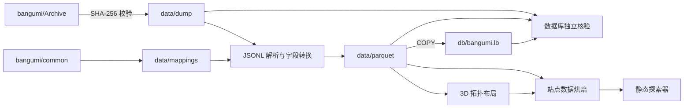
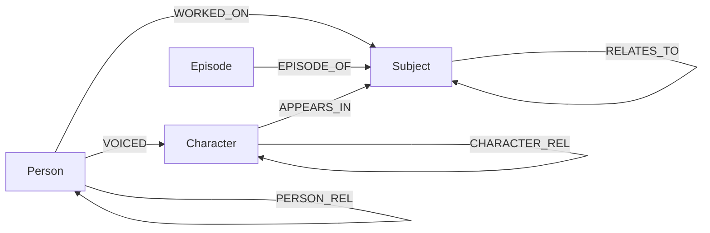

# 数据管道与图模型

本文说明如何将 [bangumi/Archive](https://github.com/bangumi/Archive)
的每周数据快照转换为共享 Parquet 投影、可查询的 LadybugDB 数据库和静态探索器数据。
构建和本地运行入口见 [README](../README.md)，前端见
[EXPLORER_ARCHITECTURE.md](EXPLORER_ARCHITECTURE.md)。数据版本、规模和耗时只记录在
生成产物与构建日志中，不在设计文档中维护。

分层发布完整结构语义和按需长文本的后续方案见
[结构化站点数据与按需长文本设计](STRUCTURAL_SITE_DATA_DESIGN.md)。该方案尚未实现；
本文继续描述当前管道与产物。

## 1. 架构概览

管道每周执行一次全量构建。Parquet 为数据库、布局和站点数据提供共享的类型化投影；
LadybugDB 单独用于查询，静态站点运行时不读取它。

设计目标：

- **保真**：经过摘要校验的原始快照是唯一可信的无损数据源；类型化投影保留
  原始枚举码，任何未声明的顶层或嵌套字段都阻断构建。
- **可验证**：源计数、悬空引用和全部表内容均由独立逻辑核验。
- **可复现**：数据版本随 Parquet 保存；复用中间产物时执行版本核对。
- **易部署**：数据库是单文件产物，探索器是静态文件，二者都不依赖常驻服务。

## 2. 输入数据契约

### 2.1 数据文件

快照包含 9 个 JSON Lines 文件；`aux/latest.json` 提供下载地址和 SHA-256。

实体文件：

| 文件 | 实体 |
|---|---|
| `subject` | 作品条目 |
| `person` | 人物或组织 |
| `character` | 角色 |
| `episode` | 分集 |

关联文件：

| 文件 | 关系 |
|---|---|
| `subject-relations` | 作品之间的续集、改编等关系 |
| `subject-persons` | 人物参与作品 |
| `subject-characters` | 角色登场于作品 |
| `person-characters` | 人物在指定作品中为角色配音 |
| `person-relations` | 人物之间或角色之间的关系 |

验证器针对每个快照重新计算源行数、悬空引用和实际入库数。

### 2.2 源数据语义

- 枚举码具有命名空间。相同数值会因作品类型不同而表示不同含义，例如动画
  `1` 表示“原作”，书籍 `2001` 表示“作者”。映射来自
  [bangumi/common](https://github.com/bangumi/common)。
- `infobox` 是未解析的 wiki 源码。管道原样保存，不在导入阶段推断结构。
- 关联文件通过 ID 引用实体。只有两个端点都存在时，关系才能写入图数据库。

### 2.3 已知数据质量问题

| 问题 | 处理方式 |
|---|---|
| 悬空引用指向已删除实体 | 跳过对应边并逐表计数；节点数据不受影响 |
| `episode.sort` 包含极端值和小数 | 使用浮点列保存，不做破坏性修正 |
| 音乐类作品没有 platform 命名空间 | `platform` 保持为空，不计为解码失败 |
| 官方文档遗漏部分关系枚举值 | 使用公开 API 验证后的映射，并保留关系原始码 |
| 历史枚举码无法解码 | 由验证器维护显式基线；基线增长会产生警告 |
| `person-relations` 出现未知端点类型 | 阻断构建；先定义端点实体和关系表，不能跳过 |

## 3. 图模型

### 3.1 节点与关系

关系方向与源数据保持一致。具体语义保存在关系属性中，而不是拆成数百种边类型。

| 边表 | 方向 | 来源 | 关键属性 |
|---|---|---|---|
| `WORKED_ON` | Person → Subject | `subject-persons` | `position`、`position_cn`、`appear_eps` |
| `VOICED` | Person → Character | `person-characters` | `subject_id`、`type`、`summary` |
| `APPEARS_IN` | Character → Subject | `subject-characters` | `type`、`role_cn`、`sort_order` |
| `RELATES_TO` | Subject → Subject | `subject-relations` | `relation_type`、`relation`、`sort_order` |
| `EPISODE_OF` | Episode → Subject | `episode.subject_id` | 无附加属性 |
| `PERSON_REL` | Person → Person | `person-relations` 中的 `prsn` | `relation_type`、`relation`、`spoiler`、`ended` |
| `CHARACTER_REL` | Character → Character | `person-relations` 中的 `crt` | `relation_type`、`relation`、`spoiler`、`ended` |

`position_cn`、`role_cn` 和 `relation` 是导入时生成的中文解码列；原始枚举码
始终保留。完整 DDL 见 [`scripts/build_db.py`](../scripts/build_db.py)。

### 3.2 建模决策

#### Episode 归属建模为边

`episode.subject_id` 同时保留为节点属性，并生成 `EPISODE_OF` 边。属性支持直接
过滤，边支持路径查询。对于所属作品已删除的分集，属性仍能记录原始归属。

#### 配音三元关系压平

“人物在某作品中为某角色配音”包含人物、作品和角色三个实体。图中使用
`Person → Character` 的 `VOICED` 边，并将作品 ID 保存为边属性
`subject_id`。

#### 同类关系分表

`person-relations` 同时包含人物关系和角色关系。由于边表端点类型必须固定，
导入时按 `person_type` 拆为 `PERSON_REL` 和 `CHARACTER_REL`。

## 4. 字段转换

Parquet 是面向建图的类型化投影，不能反向还原为原始 JSONL。下表列出会改变表示方式或
筛选记录的规则；其余已声明字段按原始语义写入。上游出现未声明的顶层或嵌套字段时，
构建立即失败。必须先明确新字段的类型和去向，不能只发出警告后丢弃。

| 转换 | 规则 |
|---|---|
| `platform` | 原始整数写入 `platform_code`，解码名称写入 `platform` |
| 其他枚举解码 | 按“实体类型 + 枚举码”生成名称列，同时保留原始码 |
| `favorite` | 展开为 `wish`、`done`、`doing`、`on_hold`、`dropped` |
| `score_details` | 转为固定 10 项的 `INT64[]`，第 1 至 10 项分别对应 1 至 10 分；缺失计数填 0 |
| `tags` | 转为 `STRUCT(name STRING, count INT64)[]` |
| `order` | 重命名为 `sort_order`，避免与保留字冲突 |
| 空值与缺失值 | 文本和列表空值归一为 `""`、`[]`；可空标量保留 `NULL`；缺失计数按字段语义填 0，布尔空值取 `false` |
| 重复主键 | 在 Parquet 阶段保留首次出现的记录 |
| 悬空关系 | 端点不存在时不进入关系 Parquet，并逐表报告数量 |

### 4.1 数据产物边界

- `data/dump.zip` 保存经摘要校验的上游归档，`data/dump` 保存解压后的内容。后续需要
  重新解释数据时，以这两个产物为来源。
- `data/parquet` 和 LadybugDB 保存已声明 schema 的建图投影。重复记录和悬空关系会被
  筛选，`null` 与默认值的区别也可能被归一，因此不能将这些产物视为无损原始快照。
- `site/data` 是面向探索器的有损投影，只发布搜索、过滤、布局、详情和关系导航所需内容。
  例如 Episode 不进入 Canvas，`infobox` 和部分关系属性不进入站点数据。
- `edges.bin` 是全局语境用的抽样骨架；完整的已发布邻接通过 `adj.pack` 按需读取。

因此，“原始数据仍可取得”和“浏览器可查询全部原始字段”是两个不同承诺；本项目只承诺
前者，站点投影的具体边界由
[EXPLORER_ARCHITECTURE.md](EXPLORER_ARCHITECTURE.md) 定义。

节点的主要查询字段：

| 节点 | 主要字段 |
|---|---|
| `Subject` | 名称、类型、平台原始码与名称、日期、评分、排名、收藏状态、标签、简介、infobox |
| `Person` | 名称、类型、职业、评论数、收藏数、简介、infobox |
| `Character` | 名称、角色类型、评论数、收藏数、简介、infobox |
| `Episode` | 名称、播出日期、排序、类型、碟片、时长、作品 ID、简介 |

## 5. 构建流程

| 命令 | 职责 |
|---|---|
| `scripts/fetch_dump.py` | 下载快照、校验 SHA-256、清理并重新解压 |
| `scripts/build_db.py` | 生成 Parquet，在临时路径 COPY 全量建库，完成后原子替换正式数据库 |
| `scripts/verify_db.py` | 执行独立计数、全字段内容核验和查询冒烟测试 |
| `scripts/layout.py` | 从 Parquet 生成 Canvas 3D 拓扑布局 |
| `scripts/bake_site.py` | 从 Parquet 和布局生成静态站点数据 |

`build_db.py` 包含三个阶段：

1. 刷新枚举映射；`--offline` 使用本地快照。
2. 流式解析 JSONL，转换字段并写入 Parquet；`--skip-parquet` 可复用结果。
3. 在同目录临时文件中创建 LadybugDB，先导入节点再导入边；完整关闭后原子替换旧库。

使用 `--skip-parquet` 时，若 dump 与 Parquet 均有 `VERSION` 标记，两者必须一致，
否则构建失败。任一标记缺失时，当前实现会发出警告后继续。每周发布始终重新生成
Parquet，不走该兼容路径。

## 6. 验证与失败策略

验证器独立于导入逻辑计算以下不变量：

1. 源实体的唯一主键数，以及关联文件端点有效的行数。
2. 每张节点表和边表的实际行数。
3. Parquet 与 LadybugDB 之间每一行、每一列的内容指纹。
4. 重复行敏感且与扫描顺序无关的多重集摘要。
5. 代表性多跳查询结果。

生成 Parquet 时，未知顶层字段、未知嵌套字段或无法建模的 `person_type` 会立即阻断
构建。验证器还会独立检查 `person_type`；发现无法建模的值时同样阻断构建。数据库计数、
内容或查询结果不一致时，验证器以非零状态退出，并阻断后续布局、站点烘焙和发布。
对于无法解码但保留了原始码的历史关系枚举，验证器会报告其数量，并将超过显式基线的
增长标记为警告。

## 7. 关键取舍

| 决策 | 理由 | 影响 |
|---|---|---|
| 使用 Parquet 中转 | 适合批量 COPY，也能被布局和站点烘焙直接读取 | 增加一个共享、可检查的中间产物 |
| 每周全量重建 | 避免增量状态和跨版本迁移 | 临时建库成功后才替换上一份数据库 |
| 原始快照作为唯一无损数据层 | 避免重复建设 Raw Parquet；建图层只承担查询职责 | 投影中的筛选和归一必须显式，新增字段必须先建模 |
| 悬空边不入库 | 图数据库无法建立端点缺失的边 | 必须逐表计数并在验证报告中公开 |

当前数据版本、表行数、文件体积和阶段耗时分别以 `data/dump/VERSION`、验证输出、
`site/data/manifest.json` 和 Actions 日志为准。
