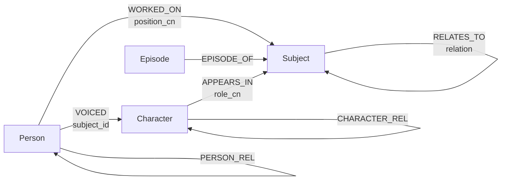

# bangumi-atlas 设计文档

[bangumi/Archive](https://github.com/bangumi/Archive) 每周 dump → 图数据库,
用于多跳关系查询。产出单个库文件 `db/bangumi.lb`,以
[LadybugDB](https://ladybugdb.com)(嵌入式,类 SQLite)打开即查。
安装与查询见 [README](../README.md)。数据版本:dump-2026-07-28。

## 1. 原始数据

9 个 jsonlines 文件(每行一个 JSON 对象),zip ~406MB / 解压 1.78GB,
周三更新,`aux/latest.json` 给地址与 SHA256。

4 个实体文件:subject 67.0万(作品条目)、person 9.9万(人物/公司)、
character 21.7万(角色)、episode 167.6万(分集,含 subject_id 外键)。

5 个关联文件,每行以 id 指向实体:

```
{"person_id":47218, "subject_id":1, "position":2001} → 人物 47218 以职位 2001 参与条目 1
```

| 文件 | 行数 | 语义 |
|---|---|---|
| subject-relations | 91.6万 | 条目↔条目(续集/改编…) |
| subject-persons | 211.0万 | 人物参与条目(staff) |
| subject-characters | 43.8万 | 角色登场于条目 |
| person-characters | 28.1万 | 人物在某条目中为某角色配音 |
| person-relations | 7.1万 | 人物↔人物、角色↔角色 |

读数据的前提:枚举码**分命名空间**——含义取决于条目类型(动画 1=原作、
书籍 2001=作者、游戏 1001=开发),映射表在
[bangumi/common](https://github.com/bangumi/common);`infobox` 是未解析的
wiki 源码,原样入库。

实测的坑:悬空引用(episode 1.5万、其余数千)指向已删除条目,无法建边;
`episode.sort` 有 7 条天文数字脏值(源站列 float、无校验),且集数含小数,
列用浮点;官方文档有遗漏——`person-characters` 的 `type` 字段未记载,
`subject-characters` 的 type 除 1/2/3(主角/配角/客串)外还有
4/5/6(闲角/旁白/声库,经公开 API 实测确认)。

## 2. 图模型

实体文件 → 同名节点表(id 主键,一行 = 一个节点);关联文件 → 边表
(一行 = 一条边,两个 id 定位端点,其余字段作边属性):



7 张边表是结构分类;具体关系语义存在 ★ 列的取值里,全库约 290 种:

| 边 | 连接 | 来源 | 边属性(★ = 导入时解码生成,源数据无此字段) |
|---|---|---|---|
| `WORKED_ON` | Person→Subject | subject-persons | position、★position_cn(207 种:原画/作曲/出版社…)、appear_eps |
| `VOICED` | Person→Character | person-characters | subject_id、type、summary |
| `APPEARS_IN` | Character→Subject | subject-characters | type、★role_cn(6 种:主角/配角/客串/闲角/旁白/声库)、sort_order |
| `RELATES_TO` | Subject→Subject | subject-relations | relation_type、★relation(31 种:系列/改编/续集…)、sort_order |
| `EPISODE_OF` | Episode→Subject | episode 的 subject_id | — |
| `PERSON_REL` | Person→Person | person-relations(prsn) | relation_type、★relation(16 种:配偶/老师…)、spoiler、ended |
| `CHARACTER_REL` | Character→Character | person-relations(crt) | relation_type、★relation(28 种:亲属/朋友…)、spoiler、ended |

需要设计的三处映射:

- **episode.subject_id 抽成边**:留作节点属性只能过滤,成边才能参与路径查询;
  节点上同时保留一份,孤儿集(所属条目已删除)靠它记录归属
- **person-characters 三元关系压平**:"人在某作品中配某角色"有三方而边只有两端,
  建 Person→Character 边,作品降为边属性 subject_id
- **person-relations 拆两表**:边表端点类型必须固定,按 person_type 拆分

字段变换(其余 1:1 入库):

- 枚举码按"条目类型 + 码"解码为中文新增列(★ 列及节点的 type_name、platform),
  原始码保留
- `favorite` → 五个整数列;`score_details` → `INT64[]`(下标 = 分数);
  `tags` → `STRUCT(name,count)[]`
- `order` → `sort_order`(保留字);主键去重;null 归一 `""`/`[]`

完整 DDL 见 `scripts/build_db.py`。

## 3. 构建流程

三个脚本:`fetch_dump.py`(下载 + SHA256 校验 + 清空重解压)→
`build_db.py`(全量重建,约 1 分钟)→ `verify_db.py`(独立对账 + 冒烟查询,
不匹配非零退出)。build_db.py 内部三阶段:

```
阶段0  bangumi/common ──下载──> data/mappings/*.yml      (--offline 跳过)
阶段1  data/dump/ ──解析/变换──> data/parquet/            (--skip-parquet 跳过 0/1)
阶段2  data/parquet/ ──COPY──> db/bangumi.lb
```

- **阶段 0**:刷新枚举映射表;下载失败回退本地快照并打印,无快照才终止
- **阶段 1**:orjson 流式解析,执行 §2 变换。先读 subject 建 `id→类型` 字典
  (解码与端点检查共用);悬空边跳过并计数,节点照常入库;解码失配汇总打
  WARNING,基线 6 条(上游已删的历史码)
- **阶段 2**:删旧库 → DDL 建表 → 先节点后边 COPY → 逐表 count 回显

取舍:**Parquet 中转**(COPY 比逐行插入快两个数量级,数组/结构体类型无损);
**每周全量重建**(约 1 分钟,增量同步不值得);**全保真**(字段 1:1 入库,
唯一例外是悬空边,过滤必打印计数)。

实测(M 系列 MacBook):268 万节点、546 万边,库 1.1GB,多跳查询亚秒。
