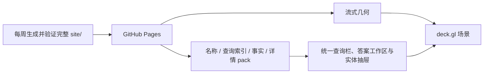

# 探索应用架构

本文记录“Bangumi 星图”的产品、交互、渲染和发布边界。数据管道见
[DATA_ARCHITECTURE.md](DATA_ARCHITECTURE.md)，SiteRelease 与浏览器 Data 合同见
[STRUCTURAL_SITE_DATA_DESIGN.md](STRUCTURAL_SITE_DATA_DESIGN.md)，查询合同见
[QUERY_CAPABILITY_DESIGN.md](QUERY_CAPABILITY_DESIGN.md)。发布规模和耗时由生成产物记录。
最终站点是 GitHub Pages 纯静态产物，浏览器不运行 LadybugDB。

| 项目 | 设计 |
|---|---|
| 产品 | 作品、人物和角色的 3D 关系探索器 |
| 部署 | GitHub Pages 静态站点，无运行时后端 |
| 更新 | 每周全量构建并原子发布 |
| 原则 | 全图提供语境，用户控制的关系工作集承载交互 |

## 产品边界与质量目标

目标环境是支持 WebGL、鼠标和键盘的桌面浏览器。界面适应桌面窗口尺寸与浏览器缩放；手机和平板的专属布局
和触摸交互不属于发布合同。实时更新、通用图查询控制台和无界多跳邻居扩张不在当前范围内。首屏必须渐进呈现，
后台加载不能阻塞交互；查询必须可取消。当前选中节点以及用户显式固定根节点的一跳关系边完整绘制，
封面和常驻文字仍保持有界预算。
设备配置、耗时和帧率只记录在可重复的测量报告中，未验证的数值不构成发布承诺。

## 系统架构

星图只包含 `Subject`、`Person` 和 `Character`。度通常为 1 的 `Episode` 只在
作品详情中展示。运行时分为完整的**语境层**和由当前焦点及会话内保留扇区组成的
**工作集**；后者承载高亮、完整一跳关系和交互反馈。关系线数量跟随完整事实与用户
显式保留操作，不设置隐藏上限；封面和常驻文字只覆盖当前焦点热度最高的 50 条关系
以及所有固定根节点。
固定根节点与一跳扇区以不可变会话快照发布；渲染层将正在展开的当前扇区和稳定的历史
扇区分离，因此当前级联动效与相机变化可以复用历史 TypedArray 和 deck.gl 图层。新增或
撤销图钉、以及几何流提供新坐标时才重建对应历史层。

布局、社区、名称和全文候选索引全部离线计算。浏览器在 Worker 中执行可取消的
筛选、关系、集合、聚合和路径查询，不设置隐藏的结果或执行配额；主线程负责渲染与交互，
GPU 承担节点拾取。
可分享状态由一个 `QueryBundle`、视图状态和内容寻址的数据版本恢复。

| 数据 | 加载策略 |
|---|---|
| `manifest.json` | 启动时加载并验证数据契约 |
| Canvas 几何 SoA | 并行流式，首块到达即渲染 |
| 身份、名称、查询与详情数据 | 按需 Range 读取并进入有界缓存 |
| `edges.bin`、`labels.json` | 随发布产出并接受离线核验；探索端当前不加载，边与名称来自当前或已固定节点的工作集 |

### 技术选型

| 层 | 选型 | 理由 |
|---|---|---|
| 数据转换与数据库 | Python、Arrow、LadybugDB | 类型化列式转换和独立图查询产物 |
| 布局与站点烘焙 | Python、Arrow、igraph | 直接读取 Parquet 生成静态投影 |
| 3D 布局 | 分量分区、Leiden 社区岛、UMAP-3D 局部拓扑、加权社区超图 | 社区边界可辨，同时保留局部关系与三轴纵深 |
| 社区检测 | Leiden + 大社区锚点归并 | 将最大分量稳定约束为可阅读数量的宏社区 |
| 渲染与拾取 | deck.gl | 直接消费 TypedArray，提供 GPU 拾取 |
| 客户端 | TypeScript strict | 明确手写的浏览器数据契约 |
| DOM 状态 | 原生 DOM + 微型 store | 界面状态和更新频率有限 |
| 统一查询 | 原生 DOM + 类型化 QueryDraft | 用范围、名称、语义 Token、字段优先添加器和显式执行统一查询交互 |
| 构建与托管 | esbuild、Actions、Pages | 无后端，支持定时静态发布 |

仅在构建超出 CI 时限、前端状态显著增长或性能分析证明存在稳定瓶颈时复议对应
选型。尚未出现的需求不作为提前引入框架或 WASM 的理由。

## 交互与可访问性

### 探索与查询

探索循环是“定位 → 理解 → 缩小 → 继续探索”。统一查询栏只维护一份类型化
`QueryDraft`，容纳实体范围、名称、正文、条件、关系和排序；点击查询后才降低为
`QueryBundle`，编辑不会自动执行，运行中的同一按钮用于停止。字段、值域、关系选择、
范围收窄、排序和键盘操作的完整语义由
[atlas-query-v1 合同](QUERY_CAPABILITY_DESIGN.md) 定义，本文不重复维护。

查询结果在 Canvas 中形成工作集和高亮，精确答案在可键盘操作的 DOM 工作区显示，并可
返回保留状态的 Canvas。底层集合、聚合和路径能力仍由同一执行器提供，但不会暴露为
互相割裂的默认执行模式。

| 视图能力 | 行为 |
|---|---|
| 相机 | turntable 轨道相机，无 roll；支持自由平移、飞行、全图和俯视正交 |
| 拾取与预取 | GPU 拾取返回 rank；悬停名称按需，停留 150 ms 后低优先级预取实体与事实结构，不读取分集或文本 |
| 聚光与透视（X-ray） | 语境层降亮到约三成；工作集提亮、保持高对比并为遮挡部分绘制描边 |
| 边与名字 | 默认不显示边和工作集名字；选中后读取全部事实页并显示每条可解析的一跳关系边。当前扇区使用白色，固定节点的扇区使用较弱的粉色；热度最高的 50 条当前关系显示常驻节点名、关系名和可选封面，其余边可悬停读取关系 |
| 固定节点与逐步展开 | 详情顶部图钉把当前根节点及其完整一跳边扇固定到会话工作集；之后选择并固定下一个节点会累积新扇区，而不会覆盖旧扇区。管理器标出“已选中”，支持回看、逐个取消固定和全部取消固定；取消固定只撤销该根节点拥有的扇区，其他根节点共享的内容仍保留。点击空白或按 Esc 只取消选中，不清除固定节点；固定节点不写入分享 URL |
| 关系方向 | 边上 "▶" 箭头指向关系目标端并随相机转向；文案 "← " 前缀表示指向选中节点；亮度梯度的亮端为目标端 |
| 缩放 | `fitZoom` 只用于全图初始视角和复位；局部聚焦、近场标签和巡航上限由 manifest 的 `layout.minimum_node_center_distance` 标定，最远缩放下限仍为全局安全界 `-2`。滚轮越过标定后的巡航上限即转为等速前进——放大倍率有顶、前进没有顶 |

节点聚焦使用发布几何标定后的局部层级；工作集节点、封面、光晕和语境节点的 common-unit
尺寸也由同一标定换算，使发布坐标尺度变化时保持原有屏幕像素语义。附近普通节点名在
聚焦后继续深入固定的屏显距离才出现，而不是依赖某个写死的绝对 zoom。滚轮放大以
光标下的节点为锚点，脱靶时回退到光标射线附近最近的可见节点；枢轴随放大向锚点三维
收敛，锚点钉在原屏幕像素上，缩放深度不会停滞。一次连续滚动锁定同一锚点（停顿或
光标移开后重新解析），避免逐事件换锚造成深度突进忽大忽小。指向真空或缩小时保持
当前枢轴，空平面永远不会成为新关注点。用户平移和 URL
恢复不受数据包围盒（bbox）限制；bbox 只用于全图取景和裁剪面计算。远裁剪面始终覆盖
从当前枢轴到整个布局包围盒的范围。

### URL 状态

URL 承载可分享状态：

| 参数 | 含义 |
|---|---|
| `c`、`o` | 相机位姿和正交模式 |
| `n` | 选中节点的稳定 key（由实体类型和 ID 组成） |
| `r` | rank 提示，仅用于未流式覆盖时的 Range 点查 |
| `qb` | 规范的单一 `QueryBundle` |

离散导航写入浏览器历史，连续相机和查询编辑变化只更新当前项。恢复以稳定 key 为准。
如果所需几何尚未流式加载，浏览器先按 rank 提示执行 Range 点查并核对 key；核对成功
即可恢复。仍无法确认稳定身份时，暂缓恢复整个 URL 状态，待几何全部就绪后再一次性
恢复。首屏 URL codec 把 `qb` 当作不透明字符串，只有动态查询运行时才解释和规范化
`QueryBundle`；无查询的相机或节点深链不会把查询文档 codec 拉入首屏 chunk。

### 界面与输入

画布占满主内容区，左上方的统一查询栏按需扩展为有界答案工作区，右侧为详情抽屉；收起
答案后保留查询状态。空间不足时 Token 整体换行，输入与查询动作保持可用。

抽屉是渐进式实体档案，按用户任务分成四个视图：

- **概览**默认打开，先解释“这是什么”：身份、关键统计、简介、完整收藏/评分分布及
  标签入口；作品、人物和角色各自只展示有意义的结构字段。
- **关联**解释“它与谁有关”：事实先按作品谱系、创作者与制作、角色与出演、配音、
  人物和角色关系等稳定语义分区，再保留源枚举标签；条目可直接沿图谱行走。界面只显示
  分组、条目和影响可用性的异常，不重复原始记录数、去重节点数或点击说明。
- **分集**是作品的独立浏览视图，仅在第一次选择时加载，单集介绍继续按需读取。
- **资料**仅在第一次选择时加载 Wiki `infobox`，再用 Bangumi 官方
  [`@bgm38/wiki`](https://github.com/bangumi/wiki-parser) 在浏览器中解释为有序字段；
  普通值、命名列表项和重复字段都保留为可扫描结构。无法解析的内容和完整原始源码
  始终以转义纯文本保留。`infobox` 不进入字段查询或全文索引。

简介是用户理解实体的一级信息，在结构内容首次绘制后自动请求；过长简介与源码仍分段
渲染。分集和资料不因节点悬停、选中或概览渲染而预取。四个标签均保持原生键盘可聚焦，
标签和内容面板使用 tablist/tabpanel 语义关联。
查询建议或答案中的 Episode 不会创建 Canvas 节点；激活它时通过 `subjectRef` 定位所属作品，打开“分集”视图并聚焦对应条目。
所属作品无法解析时，保留原结果并进入可见错误通道。

| 输入 | 结果 |
|---|---|
| 左键拖动 / 滚轮 | 平移 / 向光标附近几何收敛缩放，真空处原地缩放 |
| 右键拖动 | 轨道旋转 |
| 单击节点 | 选中节点并打开详情；视图保持当前位置 |
| 详情图钉 | 固定或取消固定当前节点 |
| 固定节点管理器 | 回看、逐个取消固定或全部取消固定；展开时 `Esc` 先收起管理器 |
| 单击空白或 `Esc` | 取消选中；固定节点继续显示 |
| 单击关系条目 | 沿关系移动到新节点 |
| 浏览器后退 | 返回上一离散状态 |

常驻图例在一行内说明节点颜色和平移、旋转、缩放、选中、取消选中；它只提供说明，
不接受点击。主要控制均可键盘聚焦并具有可访问名称；固定节点管理器用文字同时表达数量、实体类型和
“已选中”状态，不以颜色作为唯一线索，并在取消固定后把焦点移到相邻操作。查询栏使用 combobox/listbox 语义，显示命中
片段、实体种类、别名以及加载、无结果、错误和单字提示；查询按钮是执行完整名称查询的唯一入口。建议列表
可以限制同时渲染的行数，但不能把该数量当作查询答案上限；动画遵循
`prefers-reduced-motion`。作品、人物和角色分别使用 `#3d8ede`、`#e56a40` 和
`#27ab7c`，与背景的对比度不低于 3:1；类型同时以文字和图例表达，不依赖颜色
作为唯一通道。

## 数据与模块契约

浏览器只接受与 `scripts/site-contract.json` 兼容的 manifest。完整文件必须匹配声明的大小
与摘要，Range 响应必须精确，资源上限只能收紧；网络、解析和校验错误进入可见错误通道。
活跃会话固定一个内容寻址发布，不能混用新旧索引和 pack。完整格式、缓存与发布切换合同由
[STRUCTURAL_SITE_DATA_DESIGN.md](STRUCTURAL_SITE_DATA_DESIGN.md) 定义。

`Data` 是实体、事实、分集和长文本的唯一语义入口；Canvas 只接收 Scene Model，不读取
pack 或文本。当前选择和固定根节点使用完整事实分页，Episode 只在 DOM 中展示。名称与
全文索引只产生候选，最终命中仍由权威字段确认；完整查询语义由
[QUERY_CAPABILITY_DESIGN.md](QUERY_CAPABILITY_DESIGN.md) 定义。

### 模块边界

| 模块 | 职责 |
|---|---|
| `layout.py` | 分量检测、社区岛/卫星/球壳布局、UMAP-3D 和几何质量报告 |
| `bake_site.py` | 几何、名称、实体、事实、分集、文本侧车、搜索、标签和 manifest |
| `verify_site.py` | SiteRelease 与 Parquet 的独立内容与门禁对账 |
| `scene.ts` / `camera.ts` | deck.gl 场景、可见性、拾取和相机 |
| `loader.ts` | 流式读取、Range、完整性校验、分族计权 LRU 与发布切换检测 |
| `data.ts` | 语义与文本数据的唯一入口(实体/事实/分集/长文本) |
| `store.ts` / `url.ts` | 可观察状态与浏览器历史 |
| `search.ts` / `query/query-bar.ts` / `query/workbench.ts` | 名称建议、统一查询栏与答案工作区 |
| `drawer.ts` | 详情交互 |
| `labels.ts` | 工作集标签图层(节点名/关系名/方向箭头)与 CPU 去重叠 |

Python 与 TypeScript 各自维护数据契约类型。修改 manifest 或二进制格式时必须同步
更新两侧实现和契约测试。

## 关键架构决策

### 范围

- **保留拓扑体积**：每个社区的拓扑决定三个坐标轴且不压缩任何一轴，星图仍是可以
  绕看和飞入的三维体。最大连通分量按宏社区形成留有间隙的岛屿；会话内逐步展开只在
  Scene Model 叠加关系扇区，不改变或重算发布几何。俯视正交仍可用作固定角度，但不承担平面地图职责。
- **Episode 不进入星图**：叶节点会显著增加规模而不扩展大多数路径；若上游增加
  分集级 staff 或角色关系，再评估按需展示。
- **孤立节点包成外层球壳**：无边节点没有结构位置，按类型和年份铺在实体外的球面上
  并默认降亮，仍可搜索和定位。代价是全图视角下球壳会遮住核心，需要飞入才能看到
  内部结构。

### 布局与渲染

- **分量与社区分层布局**：最大分量按 Leiden/UMAP 拆成宏社区岛，其他分量形成卫星，
  孤立节点进入外层球壳。布局参数参与 `shape_digest`，但不读取历史坐标；分享状态依赖
  稳定实体 key，不依赖节点位置。
- **发布坐标全局分离**：最终节点中心必须通过确定、有界内存的算法保持最小间距，不能
  依赖屏幕空间分散掩盖重叠；客户端按验证后的实际 bbox 取景，并以 manifest 声明且验证
  通过的中心距下限统一标定局部导航和 common-unit 装饰尺寸。
- **稳定语境渲染**：完整节点集常驻 GPU，视口决定可见范围；聚光通过颜色混合表达，
  只有瞬时反馈使用透明度或固定像素尺寸。
- **线性 SoA 而非 3D Tiles**：当前几何可完整驻留 GPU；只有实测容量或首屏门禁失效时
  才引入分层细化。
- **运行时生成 SDF**：deck.gl `TextLayer` 不支持直接注入外部图集，因此只在离线阶段
  确定字符集，图集则在首屏后生成；只有性能分析证明其成为瓶颈时才定制管线。
- **使用发布标定的空间层级**：远景聚合由空间密度和分级标签表达；同一发布内的层级
  稳定，但不会把某一版坐标单位写死到客户端，也无需为展开或合并新增 URL 状态。

### 数据交付与可选媒体

- **gzip 成员 pack**：Range 读取在静态托管上提供按需访问；完整格式与回退预算由
  [SiteRelease 合同](STRUCTURAL_SITE_DATA_DESIGN.md) 定义。
- **封面是可选增强**：底层类型色圆点始终存在；封面只覆盖有界工作集，单图失败不影响
  关系探索。需要强一致图片时改用本地烘焙或同源代理。
- **控制表现层范围**：保留空间聚簇、NSFW 数据位和 URL 分享；社区着色、独立
  NSFW 开关和节点分享卡片收益较低，暂不纳入。

## 发布、验证与测量

### 质量门禁

Pages 只接收 weekly workflow 生成并完整验证的隔离 staging 目录；上游与中间产物不写入
Git 历史。构建和门禁命令以 [BUILD.md](BUILD.md) 为准。

本地 smoke 证明实际加载链发出 Range 请求且 staging 响应满足协议，但不证明 Pages 的
生产传输语义。这项门禁也不包含真实浏览器交互、性能和可访问性测试；相关目标只能通过
独立测量验证，报告必须注明设备、数据版本和方法。不能仅凭单元测试或 Range smoke
通过，就认定这些目标已经达到。

### 测量来源

易变化的发布数据只维护在生成源中：

| 来源 | 权威内容 |
|---|---|
| `site/data/manifest.json` | 数据版本、节点数、产物大小与数量、布局摘要 |
| `data/layout/report.json` | 布局身份与几何质量指标 |
| Actions 构建日志 | 各阶段耗时和门禁结果 |

## 开放风险

| 风险 | 当前控制 | 后续动作 |
|---|---|---|
| 持续帧率随设备和视角变化 | 常驻装饰有界、DPR 上限；高连接节点仍完整绘边 | 定期在基准设备采样 |
| Pages 体积或带宽不足 | Range、按需加载和 SiteRelease 成员/托管体积门禁 | 推广前按实测迁移 R2 |
| 官方封面可用性和 CORS 变化 | CORS 缩放图和类型圆点回退 | 强一致需求改为本地或同源图片 |
