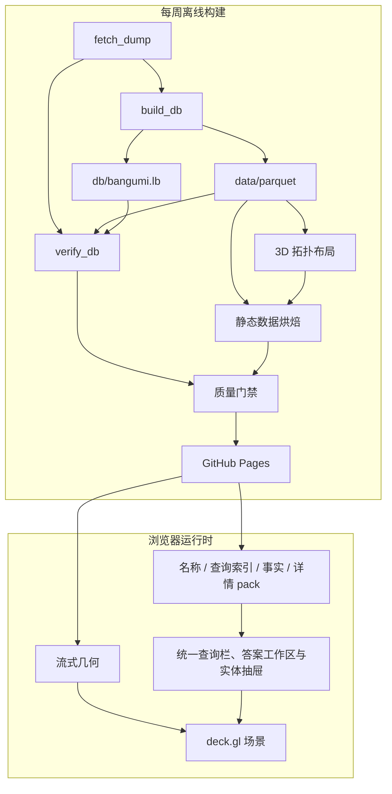

# 探索应用架构

本文记录“Bangumi 星图”的稳定产品边界、运行契约和设计理由。当前发布的节点数、
文件体积和构建耗时由生成产物记录，不在本文重复维护。底层数据管道见
[DATA_ARCHITECTURE.md](DATA_ARCHITECTURE.md)。

站点数据格式（结构核心、类型化事实、按需长文本侧车)与浏览器 Data
契约的权威定义见
[结构化站点数据与按需长文本设计](STRUCTURAL_SITE_DATA_DESIGN.md)；
本文描述交互、渲染与发布边界。

底层发布格式仍是 `structural-site-v1/explorer-v1`，其上的统一查询合同是
`atlas-query-v1`。查询语义、用户界面与发布门禁见
[静态查询能力设计](QUERY_CAPABILITY_DESIGN.md)。最终站点仍是 GitHub Pages 纯静态产物，
浏览器不运行 LadybugDB。

| 项目 | 设计 |
|---|---|
| 产品 | 作品、人物和角色的 3D 关系探索器 |
| 部署 | GitHub Pages 静态站点，无运行时后端 |
| 更新 | 每周全量构建并原子发布 |
| 原则 | 全图提供语境，小型工作集承载交互 |

## 产品边界与质量目标

目标环境是支持 WebGL、鼠标和键盘的桌面浏览器。界面适应桌面窗口尺寸与浏览器缩放；手机和平板的专属布局
和触摸交互不属于发布合同。实时更新、通用图查询控制台和无界邻居展开不在当前范围内。首屏必须渐进呈现，
后台加载不能阻塞交互；查询必须可取消，关系绘制保持有限工作集。
设备配置、耗时和帧率仅记录在可重复的测量报告中。当前 CI 尚未覆盖真实浏览器性能和
可访问性测试，因此未自动验证的数值不构成发布承诺。

## 系统架构

星图只包含 `Subject`、`Person` 和 `Character`。度通常为 1 的 `Episode` 只在
作品详情中展示。运行时分为完整的**语境层**和通常不超过数百节点的**工作集**；
后者承载高亮、关系和交互反馈。

布局、社区、名称和全文候选索引全部离线计算。浏览器在 Worker 中执行可取消的
筛选、关系、集合、聚合和路径查询，不设置隐藏的结果或执行配额；主线程负责渲染与交互，
GPU 承担节点拾取。
可分享状态由一个 `QueryBundle`、视图状态和内容寻址的数据版本恢复。

| 数据 | 加载策略 |
|---|---|
| 四个 Canvas SoA（坐标、稳定键、大小、标志） | 并行流式，首块到达即渲染 |
| `names.idx`、`names.pack` | 按 rank（热度顺序编号）分块读取，悬停、结果和关系视图按需缓存 |
| `manifest.json` | 启动时加载并验证数据契约 |
| `rank-by-key.bin` | 第一批节点绘制后低优先级加载 |
| 搜索折叠表、前缀目录与子串候选 | 聚焦时读取折叠表和目录；前缀结果立即显示，防抖后读取可取消的二元字符候选桶 |
| `edges.bin`、`labels.json` | 仍随发布产出;探索端当前不加载(边与名字只在选中态由工作集呈现) |
| 实体、事实、分集、文本 pack | 索引按需加载，成员经 HTTP Range 读取并进入分族计权 LRU；分页偏移由所属条目提供 |

发布产物的实际大小、文件数和当前托管预算以 `manifest.json` 与 workflow 为准。

### 技术选型

| 层 | 选型 | 理由 |
|---|---|---|
| 数据转换与数据库 | Python、Arrow、LadybugDB | 类型化列式转换和独立图查询产物 |
| 布局与站点烘焙 | Python、Arrow、igraph | 直接读取 Parquet 生成静态投影 |
| 3D 布局 | 分量分区、Leiden 社区岛、UMAP-3D 局部拓扑、加权社区超图 | 社区边界可辨，同时保留局部关系与三轴纵深 |
| 社区检测 | Leiden + 大社区锚点归并 | 将最大分量稳定约束为可阅读数量的宏社区 |
| 渲染与拾取 | deck.gl | 直接消费 TypedArray，提供 GPU 拾取 |
| 客户端 | TypeScript strict | 明确手写的浏览器数据契约 |
| DOM 状态 | 原生 DOM + 微型 store | 界面状态和更新频率有限 |
| 统一查询 | 原生 DOM + 类型化 QueryDraft | 用范围、名称、语义 Token、字段优先添加器和显式执行统一查询交互 |
| 构建与托管 | esbuild、Actions、Pages | 无后端，支持定时静态发布 |

仅在构建超出 CI 时限、前端状态显著增长或性能分析证明存在稳定瓶颈时复议对应
选型。尚未出现的需求不作为提前引入框架或 WASM 的理由。

## 交互与可访问性

### 探索与查询

探索循环是“定位 → 理解 → 缩小 → 继续探索”。统一查询栏默认在作品、人物和角色范围中提供名称建议；范围 Token
显示实际选中的实体类型，点击后可独立增减作品、人物、角色和分集，至少保留一种。“添加”直接展示评分、年份、
标签、关联、正文或排序等用户概念。专属筛选字段和关系会预告适用范围，并在一次可撤销修改中收窄实体范围；已有条件
不兼容时禁止扩展范围。字段在一个扁平列表中按查询语义去重；选择后在同一面板以字段 Token、运算符和值完成条件，
不重复选择字段。
排序只有一个入口并保持当前实体范围，以“先按 / 再按”显示多级优先级。多实体范围同时提供共同字段和“作品 · 评分”
这类专属字段；其他实体的该排序值为空并排在后面，不会被筛掉。
关联筛选只有一个入口；独立的全宽选择页直接显示当前发布中的全部具体关系和两端实体，搜索只缩小可滚动列表，
不使用浮动下拉框。选择关系即可确定结果类型，无需先选作品、人物或角色。
小型封闭值域使用完整可读列表，大型标签词表按需联想，实体引用连续分页；这些批次只控制传输和 DOM，不截断
可选值。数值直接显示比较和数据存在性，日期使用日期控件，不提供冗余的集合选项。封闭值域只显示有意义的
运算符；多值选择直接勾选，不要求组合键操作。
实体范围、名称、正文、条件、关系与排序保存在同一份类型化 `QueryDraft` 中，点击查询后降低为实体列表
`QueryBundle`。编辑不会自动执行，运行中同一按钮用于停止。用户不需要在搜索和详细查询之间切换，也不面对
统计、比较、路径等执行模式或内部枚举。
底层集合、聚合和路径能力仍由同一执行器提供，但不进入默认查询交互。
查询语义和字段能力由 [atlas-query-v1 合同](QUERY_CAPABILITY_DESIGN.md) 定义。

| 视图能力 | 行为 |
|---|---|
| 相机 | turntable 轨道相机，无 roll；支持自由平移、飞行、全图和俯视正交 |
| 拾取与预取 | GPU 拾取返回 rank；悬停名称按需，停留 150 ms 后低优先级预取实体与事实结构，不读取分集或文本 |
| 聚光与透视（X-ray） | 语境层降亮到约三成；工作集提亮、保持高对比并为遮挡部分绘制描边 |
| 查询结果 | 名称建议用于快速定位；展开的答案工作区展示可键盘操作的精确答案，并可返回保留状态的 Canvas |
| 边与名字 | 默认不显示任何边和名字；选中后工作集显示相连关系边、节点名（亮白、节点上方）与关系名（品红、边中点），任何距离都可读 |
| 关系方向 | 边上 "▶" 箭头指向关系目标端并随相机转向；文案 "← " 前缀表示指向选中节点；亮度梯度的亮端为目标端 |
| 缩放 | `fitZoom` 只用于全图初始视角和复位；交互使用绝对世界空间层级（[-2, 10]），滚轮越过巡航上限后转为等速前进——放大倍率有顶、前进没有顶 |

节点聚焦使用固定的局部层级。滚轮放大以
光标下的节点为锚点，脱靶时回退到光标射线附近最近的可见节点；枢轴随放大向锚点三维
收敛，锚点钉在原屏幕像素上，缩放深度不会停滞。一次连续滚动锁定同一锚点（停顿或
光标移开后重新解析），避免逐事件换锚造成深度突进忽大忽小。指向真空或缩小时保持
当前枢轴，空平面永远不会成为新关注点。用户平移和 URL
恢复不受数据包围盒（bbox）限制；bbox 只用于全图取景和裁剪面计算。远裁剪面始终覆盖
从当前枢轴到整个布局包围盒的范围。

### URL 状态

URL 承载可分享状态：

| 参数 | 含义 |
|---|---|
| `c`、`o` | 相机位姿和正交模式 |
| `n` | 选中节点的稳定 key（由实体类型和 ID 组成） |
| `r` | rank 提示，仅用于未流式覆盖时的 Range 点查 |
| `qb` | 规范的单一 `QueryBundle` |

离散导航写入浏览器历史，连续相机和查询编辑变化只更新当前项。恢复以稳定 key 为准。
如果所需几何尚未流式加载，浏览器先按 rank 提示执行 Range 点查并核对 key；核对成功
即可恢复。仍无法确认稳定身份时，暂缓恢复整个 URL 状态，待几何全部就绪后再一次性
恢复。

### 界面与输入

画布探索视图占满主内容区，左上方的统一查询栏默认保持单行紧凑态，末尾原生输入提供名称建议，右侧为详情抽屉。
添加条件或查看完整结果时，同一个查询栏扩展到主内容区顶部，答案占据有界空间；收起答案后保留查询状态。
Token 位于名称输入之前，添加、修改或删除 Token 不改写文字。空间不足时 Token 整体换行，输入与查询动作保持可用。
页面不再提供独立的“详细查询”入口，也不把查询栏复制到画布侧栏或详情抽屉。

抽屉是渐进式实体档案，按用户任务分成四个视图：

- **概览**默认打开，先解释“这是什么”：身份、关键统计、简介、完整收藏/评分分布及
  标签入口；作品、人物和角色各自只展示有意义的结构字段。
- **关联**解释“它与谁有关”：事实先按作品谱系、创作者与制作、角色与出演、配音、
  人物和角色关系等稳定语义分区，再保留源枚举标签；条目可直接沿图谱行走。
- **分集**是作品的独立浏览视图，仅在第一次选择时加载，单集介绍继续按需读取。
- **资料**仅在第一次选择时加载 Wiki `infobox`，再用 Bangumi 官方
  [`@bgm38/wiki`](https://github.com/bangumi/wiki-parser) 在浏览器中解释为有序字段；
  普通值、命名列表项和重复字段都保留为可扫描结构。无法解析的内容和完整原始源码
  始终以转义纯文本保留。`infobox` 不进入字段查询或全文索引。

简介是用户理解实体的一级信息，在结构内容首次绘制后自动请求；过长简介与源码仍分段
渲染。分集和资料不因节点悬停、选中或概览渲染而预取。四个标签均保持原生键盘可聚焦，
标签和内容面板使用 tablist/tabpanel 语义关联。
查询建议或答案中的 Episode 不会创建 Canvas 节点；激活它时通过 `subjectRef` 定位所属作品，打开“分集”视图并聚焦对应条目。
所属作品无法解析时，保留原结果并进入可见错误通道。

| 输入 | 结果 |
|---|---|
| 左键拖动 / 滚轮 | 平移 / 向光标附近几何收敛缩放，真空处原地缩放 |
| 右键拖动 | 轨道旋转 |
| `T` / `R` | 切换俯视正交 / 显示完整关系图 |
| 单击节点 | 选中节点并打开详情；视图保持当前位置 |
| 单击空白或 `Esc` | 取消或退出当前状态 |
| 单击关系条目 | 沿关系移动到新节点 |
| `S` | 聚焦统一查询栏 |
| 浏览器后退 | 返回上一离散状态 |

主要控制均可键盘聚焦并具有可访问名称；查询栏使用 combobox/listbox 语义，显示命中
片段、实体种类、别名以及加载、无结果、错误和单字提示；“查看全部匹配”位于建议之后的键盘顺序内。建议列表
可以限制同时渲染的行数，但不能把该数量当作查询答案上限；动画遵循
`prefers-reduced-motion`。作品、人物和角色分别使用 `#3d8ede`、`#e56a40` 和
`#27ab7c`，与背景的对比度不低于 3:1；类型同时以文字和图例表达，不依赖颜色
作为唯一通道。

## 数据与模块契约

通用完整性规则：

- `manifest.json` 是每次发布的数据入口；版本由上游版本和完整产物契约计算。
- 加载器在读取大文件前验证 3D 布局标记和 `positions.bin = n_nodes × 12`；
  不兼容产物立即要求重建。
- 完整文件必须匹配 manifest 中的字节数和 SHA-256；物理名必须由完整摘要和逻辑名组成。
- `206 Partial Content` 必须返回精确的范围、长度和总文件大小。
- 每个 gzip 成员同时受 manifest 声明的压缩与解压尺寸上限约束。
- manifest 可收紧但不能提高客户端的节点、成员、pack 与缓存资源上限；响应体一旦超过
  声明长度立即取消读取。
- 不支持 Range 的服务器下载完整 pack 并在内存中切片；整包回退受一个 pack 上限的
  计权 LRU 约束。
- 同一资源的并发加载共享 Promise；最后一个调用取消时中止底层请求，失败后允许重试。
- 解析、校验或网络错误进入可见错误通道，不转换为空结果。

Manifest 是 `structural-site-v1` 契约：schema、字段策略、来源、计数、限制、
布局报告，以及每个逻辑产物的字节数、SHA-256 和内容寻址物理名；内容身份是除自身外
规范内容的 SHA-256。生产器与客户端从 `scripts/site-contract.json` 取得相同的 schema
摘要、rank 编码和资源上限；客户端拒绝摘要不符或提高上限的发布。每个数据 URL 使用
完整文件摘要组成的不可变物理路径，字节未变的
文件可跨发布复用缓存。旧会话请求的对象若返回 404/410，或 Range 点查检测到
`Content-Range`、gzip 成员或文件摘要不符，则停止后续请求并显示刷新状态，不混用发布。

### 几何与名称

“收藏度”指收藏该实体的用户数：作品取五种收藏状态之和，人物和角色取
`collects`。几何记录按该指标降序排列，总计 25 字节/节点。

| 文件 | 类型 | 含义 |
|---|---|---|
| `positions.bin` | 3 × f32 | 布局生成的完整 x/y/z 坐标 |
| `year.bin` | u16 | 作品年份；未知或非作品为 0 |
| `key.bin` | u32 | `类型 << 24 | id` |
| `size.bin` | u8 | 收藏度的对数编码 |
| `flags.bin` | u8 | NSFW 标志、孤立节点标志和媒介枚举码位段 |
| `score.bin` | u8 | 评分乘以 10 |
| `tags.bin` | u32 | 前 32 个元标签的位图 |

Episode 稳定引用通过 `episode-subject.bin` 以一个 u32 点查到所属 Subject，再读取对应的
分集成员；全量分集查询一次预取 `episodes.pack` 与共享溢出页，避免逐成员网络往返。

浏览器将坐标字节直接映射为 `Float32Array`。定长记录支持按 rank 点查，但节点身份
始终由 key 验证。Canvas 绘制无需名称数据，因此首屏不必加载名称。

名称与几何记录的顺序一致，行内同时保存实体种类，再按 manifest 声明的块大小独立
gzip 并写入 `names.pack`；
`names.idx` 保存累计偏移。浏览器只解压实际访问的块。生成 manifest 前，烘焙器会回读
全部块，核对索引端点、行数和行结构；任一不符即终止。

`edges.bin` 保存按重要性降序的 u32 端点对。烘焙器先保证连通节点至少有一条
候选边，再按度归一权重补充；客户端只消费满足近景条件的前缀。

### 事实、分集、文本与搜索

事实 incidence 按 `key % 8192` 分桶写入 `facts.pack`；每个节点内联热度最高的
200 条 incidence，溢出项写入 `pages.pack`。事实保留方向、角色、原始枚举码和
multiplicity；反向文案（`← 原关系`）、固定语义标签和颜色是 Scene Model 的显示
规则，由 `mappings.json` 解码生成，不写入数据事实。

实体结构（名称、短字段与文本存在位）在 `entities.pack`，分集从属集合在
`episodes.pack`（每 Subject 内联 200 条 + 分页）。简介、`infobox` 源码、分集介绍和
事实备注是四类文本侧车。实体详情首次绘制后按存在位读取简介；`infobox`、分集集合和
分集介绍仍由对应视图或条目显式触发。空值由结构存在位表达，不触发网络请求。格式细节见
[STRUCTURAL_SITE_DATA_DESIGN.md](STRUCTURAL_SITE_DATA_DESIGN.md)。

搜索是规范化前缀的自适应树：叶成员压缩后不超过 64,000 字节，需要拆分的内部
前缀保留全部精确实体，再附加 manifest 声明数量的不同实体热度建议；它是建议投影，
不是完整结果数。至少两个码点的查询在防抖后读取候选最少的二元字符桶，再用
`search.alias.pack` 中构建期冻结的完整别名执行包含判断。别名读取返回当前候选批次的
稳定行快照，最终校验不得依赖块仍残留在共享 LRU 中。两路按实体去重并统一排序；
桶尾前不声称总数；达到下拉上限后，只有未扫描候选仍可能进入 top-K 时才保留“继续查找”，
否则提示继续输入以缩小范围。别名块从 1,024 rank 起步，任一成员超限时统一折半并在
manifest 声明实际块宽。完整 Unicode casefold 表是版本化构建输入并随 SiteRelease
发布，单码点最多展开三个码点；简繁和日文新旧字形按完整原字符串独立派生且不串联，
运行时不调用 OpenCC。
实体名称权威仍是 `names.pack`。工作集标签的名字来自
`names.pack` 按需补载，字符集由当前显示的字符串即时生成，有符号距离场（SDF）
图集随选中重建（工作集字符量级很小）；烘焙产物中的标签表与骨架边仍随
SiteRelease 发布，探索端当前不消费。

### 模块边界

| 模块 | 职责 |
|---|---|
| `layout.py` | 分量检测、社区岛/卫星/球壳布局、UMAP-3D 和几何质量报告 |
| `bake_site.py` | 几何、名称、实体、事实、分集、文本侧车、搜索、标签和 manifest |
| `verify_site.py` | SiteRelease 与 Parquet 的独立内容与门禁对账 |
| `scene.ts` / `camera.ts` | deck.gl 场景、可见性、拾取和相机 |
| `loader.ts` | 流式读取、Range、完整性校验、分族计权 LRU 与发布切换检测 |
| `data.ts` | 语义与文本数据的唯一入口(实体/事实/分集/长文本) |
| `store.ts` / `url.ts` | 可观察状态与浏览器历史 |
| `search.ts` / `query/query-bar.ts` / `query/workbench.ts` | 名称建议、统一查询栏与答案工作区 |
| `drawer.ts` | 详情交互 |
| `labels.ts` | 工作集标签图层(节点名/关系名/方向箭头)与 CPU 去重叠 |

Python 与 TypeScript 各自维护数据契约类型。修改 manifest 或二进制格式时必须同步
更新两侧实现和契约测试。

## 关键架构决策

### 范围

- **保留拓扑体积**：每个社区的拓扑决定三个坐标轴且不压缩任何一轴，星图仍是可以
  绕看和飞入的三维体。最大连通分量按宏社区形成留有间隙的岛屿；这只是固定几何层次，
  不引入运行时展开/合并状态。俯视正交仍可用作固定角度，但不承担平面地图职责。
- **Episode 不进入星图**：叶节点会显著增加规模而不扩展大多数路径；若上游增加
  分集级 staff 或角色关系，再评估按需展示。
- **孤立节点包成外层球壳**：无边节点没有结构位置，按类型和年份铺在实体外的球面上
  并默认降亮，仍可搜索和定位。代价是全图视角下球壳会遮住核心，需要飞入才能看到
  内部结构。

### 布局与渲染

- **分量与社区分层布局**：先拆分连通分量。最大分量以 Leiden 细社区为基础，按大型
  锚点和加权社区图距离归并为固定上限的宏社区；UMAP-3D 保留岛内局部拓扑，加权社区
  超图决定岛屿的全局相对位置。宏社区先按完整包围球取得稳定初始位置，再将岛内尺度
  放大并按覆盖 95% 节点的核心半径紧凑装箱；少量边缘节点允许穿插，避免离群点制造
  大片无效留白。其余非孤立分量各自整形后铺在主体外的卫星球面，孤立节点继续进入
  最外层球壳。三轴始终等比缩放。布局不读取历史
  坐标，也不约束跨版本位移；可分享状态依赖稳定实体 key，与节点位置无关。
- **发布坐标全局分离**：节点重叠必须在最终发布坐标中解决，不能靠当前工作集的屏幕
  空间分散掩盖。烘焙器先归一到 600 的名义世界跨度，再以确定、O(n) 空间的三维格点
  分配处理全部节点；最终 `float32` 中心距不得小于 0.28。分离可以扩大 bbox，之后不得
  再缩放，客户端以实际 bbox 取景，独立验证器直接检查最终坐标。全量近邻对和无收敛
  上界的迭代斥力不满足有界内存与确定性要求。
- **稳定语境渲染**：完整节点集常驻 GPU，视口裁剪自然决定屏幕内的节点。zoom
  不参与节点显隐或亮度计算。语境层用屏幕像素上下限控制全图密度；搜索、聚焦、
  路径和独立工作集的持久节点使用同一空间坐标与世界尺寸，只设远景最小可见尺寸，
  近景随相机投影自然放大。普通节点中心保持不透明，孤立、过滤和聚光的亮度通过
  RGB 向背景色混合表达，避免半透明节点在远景叠亮、近景分离后显暗。扩散环等瞬时
  反馈才使用固定像素尺寸。
- **骨架边优先覆盖**：先保证连通节点有候选边，再由客户端近景条件和 12 万条上限
  控制开销。候选边总量与覆盖率冲突时，优先保证覆盖率。
- **线性 SoA 而非 3D Tiles**：当前几何可完整驻留 GPU；规模增长约一个数量级或
  首屏预算缩短到 2 秒时再考虑分层细化。
- **运行时生成 SDF**：deck.gl `TextLayer` 不支持直接注入外部图集，因此只在离线阶段
  确定字符集，图集则在首屏后生成；只有性能分析证明其成为瓶颈时才定制管线。
- **使用固定空间层级**：远景聚合由空间密度和分级标签表达，无需为展开或合并新增
  空间层级和 URL 状态。

### 数据交付与可选媒体

- **gzip 成员 pack**：独立压缩分片后合并，通过偏移索引执行 Range 读取，以少量
  文件换取会话内缓存；不支持 Range 时回退到一次完整下载。
- **封面是可选增强**：底层类型色圆点始终存在。WebGL 工作集请求带 CORS 的
  `small` 缩放图，普通 DOM 关系头像使用 `grid`，抽屉使用 `small`；单图失败只
  移除图片。需要强一致图片时改用本地烘焙或同源代理。
- **控制表现层范围**：保留空间聚簇、NSFW 数据位和 URL 分享；社区着色、独立
  NSFW 开关和节点分享卡片收益较低，暂不纳入。

## 发布、验证与测量

### 质量门禁

Pages 只接收 Actions 生成的构建产物；上游数据和中间产物不写入 Git 历史。

| 触发 | 门禁 |
|---|---|
| Push | Python 测试、Ruff lint/格式、mypy、Web 单测、TypeScript、生产构建 |
| Pull Request | Push 门禁，以及新增依赖的 high/critical 漏洞审查 |
| 每周发布 | 上述构建门禁、源枚举漂移、数据库与 SiteRelease 独立对账、真实三维布局报告、本地 HTTP 端到端 smoke 和完整 staging 体积 |

只有真实三维拓扑布局能进入发布。构建路径唯一，步骤见 [BUILD.md](BUILD.md)。

仓库设置应保护 `main`：必须经 Pull Request 并要求 `python`、`web` 和
`dependency-review` 状态通过，禁止 force push；CodeQL 使用 GitHub 默认设置扫描
Python 和 JavaScript/TypeScript。这两项属于 GitHub 仓库设置，不由工作流文件自行开启。

这些门禁验证数据与构建正确性，但不包含真实浏览器性能和可访问性测试。相关目标只能
通过独立测量验证，报告必须注明设备、数据版本和方法。不能仅凭单元测试通过，就认定
这些目标已经达到。

站点超过 Pages 体积门禁时构建失败；实际流量接近托管配额前迁移到
Cloudflare Pages/R2，需要服务端计算时再评估 Workers。

### 测量来源

易变化的发布数据只维护在生成源中：

| 来源 | 权威内容 |
|---|---|
| `site/data/manifest.json` | 数据版本、节点数、产物大小与数量、布局摘要 |
| `data/layout/report.json` | 布局算法、随机种子与整形摘要，分量/岛屿数、核心与外缘最小岛间距、节点扩散倍率、纵深比、邻距和边紧凑度 |
| Actions 构建日志 | 各阶段耗时和门禁结果 |

## 开放风险

| 风险 | 当前控制 | 后续动作 |
|---|---|---|
| 持续帧率随设备和视角变化 | 边上限、DPR 上限 | 定期在基准设备采样 |
| Pages 体积或带宽不足 | Range、按需加载和硬体积门禁 | 推广前按实测迁移 R2 |
| 默认域名可能变化 | URL 状态不依赖域名 | 确定正式域名后重定向 |
| 官方封面可用性和 CORS 变化 | CORS 缩放图和类型圆点回退 | 强一致需求改为本地或同源图片 |
