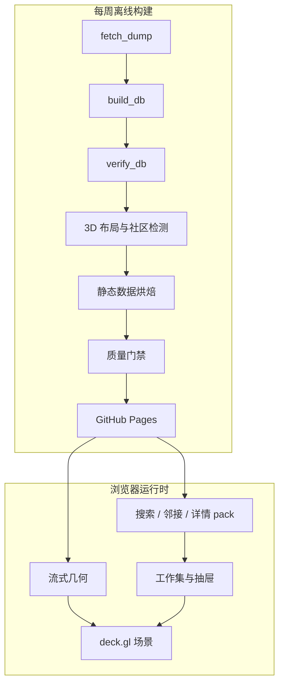

# 探索应用架构

本文描述 “Bangumi 星图” 的产品边界、运行架构、数据契约和关键设计决策。
应用已实现，目标平台是配备近五年 GPU 的桌面浏览器。底层数据管道见
[DATA_ARCHITECTURE.md](DATA_ARCHITECTURE.md)。

| 项目 | 当前设计 |
|---|---|
| 产品形态 | 面向作品、人物和角色的三维关系探索器 |
| 部署形态 | GitHub Pages 静态站点，无运行时后端 |
| 入图节点 | 985,328 |
| 更新周期 | 每周全量构建并原子发布 |
| 主要原则 | 全图提供语境，小型工作集承载交互 |

## 1. 范围与质量目标

### 1.1 目标用户

- 桌面浏览器用户。
- 配备近五年独立或集成 GPU 的设备。
- 以 Apple Silicon Mac 和 Chrome 作为性能基准环境。

### 1.2 非目标

- 移动端和低端设备适配。
- 实时数据更新。
- 通用图查询编辑器或 Cypher 控制台。
- 无界邻居展开。

### 1.3 性能预算

| 场景 | 预算 |
|---|---:|
| 首块数据可交互 | 小于 5 秒 |
| 全量几何后台加载 | 小于 30 秒，不阻塞交互 |
| 单击节点到邻居高亮 | 小于 300 毫秒 |
| 已缓存搜索分片的联想 | 小于 100 毫秒 |
| 冷搜索分片的 p95 | 小于 400 毫秒 |
| 全图渲染 | 不低于 30 fps |

渲染预算以设备像素比上限 1.5 为前提。远景纯点模式曾测得 47 fps；
该结果是回归基线，不代表所有视角的固定帧率。

## 2. 系统架构

### 2.1 图范围

星图只包含 `Subject`、`Person` 和 `Character`。`Episode` 约占完整数据库的
168 万个节点，但通常只有一条 `EPISODE_OF` 关系，因此作为作品详情展示，
不作为独立探索目的地。

运行时将节点分为两层：

- **语境层**：完整入图数据，用于呈现全局结构。
- **工作集**：当前节点、邻居或路径，规模通常不超过数百个节点，承担高亮、
  关系展示和交互反馈。

### 2.2 离线与在线边界



该边界带来四个直接结果：

1. 布局、社区、邻接和搜索索引全部离线计算。
2. 浏览器只执行渲染、有限路径查询和静态分片读取。
3. 节点拾取由 GPU 完成，不对 98.5 万个节点做 CPU 命中测试。
4. 所有可分享状态均可由 URL 和内容寻址的数据版本恢复。

### 2.3 数据加载层级

| 数据 | 当前大小 | 加载策略 |
|---|---:|---|
| 七个几何 SoA 文件 | 约 18.7 MB | 并行流式；首块到达即渲染 |
| `names.ndjson` | 约 40.3 MB | 与几何同序逐行解析 |
| `coords.parquet` | 约 21.5 MB | 仅供下周布局热启动，不进入首屏 |
| `edges.bin` | 约 6.6 MB | 随首屏加载；仅在近景显示子集 |
| 邻接、详情、搜索和分页 pack | 约 350 MB | 按索引执行 HTTP Range 请求 |
| manifest、标签和索引 | 数 MB | 启动或后台空闲阶段加载 |

Manifest 记录的站点数据总量为 449,795,443 字节，共 22 个产物文件；两项均
不含 manifest 自身。发布门禁限制总量不得超过 1 GB。

## 3. 技术选型

| 层 | 当前选型 | 选择依据 | 复议条件 |
|---|---|---|---|
| 数据与烘焙 | Python + mypy | 已有 Arrow、LadybugDB 和图算法生态 | 构建超过 CI 时限 |
| 三维布局 | igraph UMAP-3D | 全图约 15 分钟；DRL 子图超过 2 小时，ForceAtlas2 仅支持二维 | 稳定性或布局质量持续下降 |
| 社区检测 | Leiden | 支持全图规模，并可按成员重叠对齐跨周社区 | 社区标签不再产生价值 |
| 渲染与拾取 | deck.gl | 直接消费 TypedArray，提供 GPU picking 和标签碰撞剔除 | 无法维持 30 fps |
| 客户端 | TypeScript strict | 明确数据边界，当前没有适合 WASM 的 CPU 热点 | profiler 发现稳定 CPU 瓶颈 |
| DOM 层 | 原生 DOM + 微型 store | 界面更新频率低，组件数量有限 | 表单或多面板状态显著增长 |
| 构建 | esbuild | 只需转译、打包和本地服务 | 引入前端框架 |
| 托管 | Actions + Pages | 无后端，支持定时原子发布 | 超过体积或带宽预算 |

## 4. 产品与交互模型

### 4.1 探索循环

用户交互遵循四个层次：

1. **定位**：搜索作品、人物或角色，并飞行到目标。
2. **观察**：通过空间聚簇、标签和语义缩放理解全局位置。
3. **扩展**：单击节点，显示收藏度最高的 50 条关系。
4. **连接**：使用过滤结果、共同关联或有限最短路径比较节点。

同一邻居的多种关系在工作集中保留各自的边和关系标签；节点封面只绘制一次。
详情抽屉继续按关系分组，超过内联上限的关系通过“展开全部”分页读取。

### 4.2 连接查询

#### 共同关联

用户锁定起点后选择第二个节点。客户端读取两端各自收藏度最高的 200 个邻居，
计算交集，并同时显示两侧关系标签。

#### 最短路径

路径查询使用有界双向 BFS：

- 最多 6 跳。
- 每层前沿最多 48 个节点。
- 每个节点最多扩展 48 个高热度邻居。

超过边界时明确显示“未找到”，不会继续执行无界请求。

#### 过滤结果

年份、媒介、评分和标签组成查询谓词。结果面板按全局热度顺序枚举匹配作品；
视图中的媒介选择用于视觉弱化，结果面板中的媒介选择用于筛选。

### 4.3 三维交互语义

| 能力 | 行为 |
|---|---|
| 相机 | turntable 轨道相机，不允许 roll；支持飞行、复位和俯视正交模式 |
| 拾取 | GPU picking 返回 rank，再由几何包恢复稳定 key |
| 预取 | 悬停节点时预取邻接和详情分片 |
| 聚光 | 语境层降低亮度，工作集保持高对比度 |
| X-ray | 工作集先正常绘制，再为被遮挡部分绘制低亮描边 |
| 深度线索 | 雾只作用于语境层，并设置与世界尺寸相关的最小起雾距离 |
| 节点尺寸 | 使用世界空间尺寸，并设置像素上下限 |
| 骨架边 | 远景隐藏；近景只显示相机目标附近且双端可见的边 |
| 过滤 | 节点可见性和颜色主要由 shader uniform 计算 |

近景骨架边上限为 12 万条。相机和过滤条件未变化时，不重复重建边可见集。

### 4.4 URL 状态

每次离散导航写入浏览器历史；连续相机和过滤变化更新当前历史项。

| 参数 | 含义 |
|---|---|
| `c`、`o` | 相机位姿和正交模式 |
| `n` | 选中节点的稳定 key |
| `r` | rank 提示，仅用于尚未流式加载时的 Range 点查 |
| `q`、`f`、`fr` | common/path 模式及其稳定起点 |
| `y`、`m`、`s`、`t` | 年份、媒介、最低评分和标签过滤 |

恢复过程以稳定 key 为准。目标节点或连接起点尚未加载时，完整 URL 状态会挂起，
待几何加载完成后统一恢复，不会降级为普通节点选择。

## 5. 界面与可访问性

### 5.1 页面布局

- 画布占满视口。
- 左上区域依次放置搜索框、可折叠筛选器和结果列表。
- 随机传送按钮位于搜索框内。
- 右侧为 420 px 详情抽屉。
- 左下角显示节点类型图例和快捷键提示。
- 初始状态只有缓慢自转；首次交互后停止。

详情抽屉按以下顺序组织内容：标题、类型与统计信息、简介、关系分组、分集、
分页入口和 bgm.tv 外链。关系 chip 可直接切换当前节点。

### 5.2 输入约定

| 输入 | 结果 |
|---|---|
| 左键拖动 / 滚轮 | 平移 / 推拉 |
| 右键拖动 | 轨道旋转 |
| `T` / `R` | 俯视正交 / 相机复位 |
| 单击节点 | 选中节点，移动轨道枢轴并显示邻居 |
| 双击节点 | 飞行聚焦 |
| 单击空白 | 取消选择 |
| 单击关系 chip | 沿关系移动到新节点 |
| `S` | 聚焦搜索框 |
| `Esc` / 浏览器后退 | 退出当前状态 / 返回上一状态 |

所有主要控制均可通过键盘聚焦。搜索框使用 combobox/listbox 语义，画布、按钮和
滑块均提供可访问名称。动画遵循 `prefers-reduced-motion`。

### 5.3 视觉编码

界面使用黑青色背景，交互强调色采用葱色与粉色。强调色不承担类别编码。

| 节点类型 | 颜色 |
|---|---|
| 作品 | `#3d8ede` |
| 人物 | `#e56a40` |
| 角色 | `#27ab7c` |

三种类别色在当前背景上的对比度均不低于 3:1；色觉缺陷模拟下最差类别对的
OKLab ΔE 为 8.7。节点类型同时通过文字和图例表达，不依赖颜色单一通道。

## 6. 数据与模块契约

### 6.1 通用完整性规则

- `manifest.json` 是每次发布的数据入口。
- 数据版本由上游版本和完整产物契约计算，不使用构建时间。
- 完整文件必须同时匹配 manifest 中的字节数和 SHA-256。
- `206 Partial Content` 必须返回精确的 `Content-Range`、长度和总文件大小。
- 不支持 Range 的服务器只能下载一次完整 pack，后续在内存中切片。
- 同一资源的并发加载共享进行中的 Promise；失败后移除缓存，允许重试。
- 解析、校验或网络错误必须进入可见错误通道，不转换为空结果。

### 6.2 Manifest

Manifest 包含：

- 内容寻址版本和独立的上游 dump 版本。
- 节点数量、分桶参数、年份范围和布局报告。
- 标签、关系标签和高频搜索分片清单。
- 每个非 manifest 产物的字节数与 SHA-256。
- 站点总字节数与文件数。

加载 manifest 后的所有数据请求都携带 `?v=<内容版本>`，避免不同发布版本的
缓存混用。

### 6.3 几何数据

本文将“收藏度”统一定义为收藏该实体的用户数：作品取五种收藏状态之和，人物和
角色取 `collects`。七个 SoA 文件按该指标降序排列，总计 19 字节/节点。

| 文件 | 类型 | 含义 |
|---|---|---|
| `positions.bin` | 3 × u16 | 三维量化坐标 |
| `year.bin` | u16 | 作品年份；未知或非作品为 0 |
| `key.bin` | u32 | `类型 << 24 | id` |
| `size.bin` | u8 | 收藏度的对数编码 |
| `flags.bin` | u8 | bit 0 为 NSFW，bit 1 为孤立节点，bit 2–4 为媒介类型 |
| `score.bin` | u8 | 评分乘以 10 |
| `tags.bin` | u32 | 前 32 个元标签的位图 |

浏览器将坐标反量化为 Float32 后交给 deck.gl。定长记录支持按 rank 读取单点；
rank 只用于定位，节点身份始终由 key 验证。

### 6.4 名字与骨架边

`names.ndjson` 与几何顺序一致，每行是 `[name, name_cn]`。浏览器流式解析该文件，
并在完成后验证完整 SHA-256。

`edges.bin` 是 u32 端点对，按重要性降序。烘焙器先保证连通节点至少拥有一条
候选边，再按度归一权重补充。客户端只消费满足近景可见性条件的前缀子集。

### 6.5 邻接与详情 pack

邻接按 `key % 8192` 分桶。每个桶独立 gzip 后写入 `adj.pack`，
`adj.idx` 保存累计偏移。

单节点邻接结构：

```text
{
  g: [labelId, groupTotal, inlineRanks][],
  n: total,
  op?: [offset, length][]
}
```

- 每个节点整体内联收藏度最高的 200 个邻接项；各关系组记录总数和对应子集。
- 其余邻居分页写入 `pages.pack`。
- 源关系方向保持不变。
- 仅为导航补充的反向关系使用 `← 原关系` 标签，不声明源数据存在互惠关系。
- 完全重复的关系行会被去重并计数。

详情按相同桶号写入 `det-0.pack` 至 `det-3.pack`。每条详情包含短属性、完整简介
和作品分集；超过 200 集的部分写入 `pages.pack`。未解析的 `infobox` 不发布到站点。

### 6.6 搜索与标签

搜索按首字符分片并写入 `search.pack`。CJK 使用一个字符作为前缀，拉丁文本转为
小写。简体、繁体和日文新旧字形通过烘焙生成的单字映射表统一；索引与客户端
使用同一映射，避免整词转换和逐字转换产生差异。

标签数据包含约 2 万个高热度节点标签和每个社区的代表标签。字符集离线确定，
SDF 图集由 deck.gl 在运行时生成，并在首屏之后的空闲阶段加载。

### 6.7 模块边界

| 模块 | 职责 |
|---|---|
| `layout.py` | UMAP-3D、Leiden、跨周对齐、孤立节点外壳和位移报告 |
| `bake_site.py` | 几何、名字、邻接、详情、搜索、标签和 manifest |
| `scene.ts` | deck.gl 图层、可见性、边子集与拾取 |
| `camera.ts` | 轨道相机、飞行、正交和自转 |
| `loader.ts` | 流式读取、Range、完整性校验和缓存 |
| `store.ts` / `url.ts` | 可观察状态与浏览器历史 |
| `search.ts` / `drawer.ts` | 搜索交互和详情展示 |
| `labels.ts` | 标签图层和碰撞剔除 |

Python 与 TypeScript 各自维护数据契约类型。修改 manifest 或二进制格式时，必须
同步更新两侧实现和契约测试。

## 7. 关键架构决策

### 7.1 范围决策

#### 桌面三维优先

三维空间用于承载全图结构，代价是移动端覆盖和部分二维分析效率。聚光、雾、
屏幕空间尺寸和俯视正交模式用于降低可读性损失，但不假设可以完全消除该损失。

#### Episode 不进入星图

分集通常是度为 1 的叶节点。将其加入全图会使节点数增加约 2.7 倍，却不会扩展
大多数探索路径。若上游增加分集级 staff 或角色关系，可重新评估按需展示方案。

#### 孤立节点使用外围球壳

约 9.2 万个入图节点没有关系边。布局算法无法为其产生有意义的位置，因此按类型
和年份放置在外围球壳，并默认降低亮度。它们仍可搜索和直接定位。

### 7.2 布局与渲染决策

#### 布局冻结并热启动

每周使用上一版本坐标作为 seed，执行 10 个 UMAP epoch，再通过正交 Procrustes
对齐回上一坐标系。生产布局使用全部入图边，并按端点度数降低 hub 边权；社区 ID
按跨周成员重叠一对一对齐。扰动实验的 p95 位移为 2.1%，发布门槛为 3%。缺少
基线时默认禁止发布，首次部署只能通过人工明确允许冷启动。

#### 骨架边优先保证覆盖

连通节点约 89 万个，“每节点至少一条边”去重后已产生约 82.2 万条骨架边，
因此无法同时满足原定 50 万条总量目标。当前策略保留覆盖率，并由客户端近景
可见集和 12 万条上限控制帧率。

#### 继续使用线性 SoA，而非 3D Tiles

当前几何缓冲约 24 MB，可以完整驻留 GPU。只有当数据规模增长约一个数量级，
或首屏预算缩短到 2 秒时，才考虑 3D Tiles 的分层细化。

#### SDF 图集在运行时生成

deck.gl TextLayer 不支持直接注入外部图集。当前实现离线确定字符集，运行时生成
图集，并延迟加载标签层。若标签生成开始影响首屏，再考虑定制字形管线。

#### 不提供节点展开或合并

全图始终作为语境存在，远景聚合由空间密度和分级标签表达。显式展开状态会增加
URL 和跨用户位置一致性的复杂度，当前收益不足。

### 7.3 数据交付决策

#### 使用 gzip 成员组成 pack

分片 JSON 独立 gzip 后合并为少量 pack，通过偏移索引执行 Range 读取。该方案将
文件数从约 2.5 万降至 22，并将站点数据从约 955 MB 降至约 450 MB。

代价是 Range 响应通常不能依赖浏览器 HTTP 缓存。客户端使用会话内 Promise 缓存，
并为不支持 Range 的开发服务器提供完整 pack 回退。

#### 第三方封面作为可选增强

Archive 不提供图片可用性字段，官方图片端点对无图记录可能返回 404 或不支持
WebGL 纹理读取的响应。因此封面不能成为节点可见性或交互的前提。

抽屉大封面、关系头像和工作集纹理均已启用，但底层类型色圆点始终保留。DOM
图片失败时移除图片本身；deck.gl `IconLayer` 通过 `onIconError` 消化单张失败，
继续显示圆点。发布探针对官方图片端点注入确定性图片，并断言 `small`、`grid`
和 `medium` 三类请求实际发生，避免第三方可用性决定发布结果。

#### 已移除的表现层功能

| 功能 | 移除原因 | 保留能力 |
|---|---|---|
| 社区着色 | 7,654 个社区无法形成可辨颜色编码 | 空间聚簇和社区标签 |
| NSFW 开关 | 产品定位不要求特殊策略 | `flags` 中保留 NSFW 位 |
| 节点分享卡片 | 需要约一万个额外静态文件 | URL 分享和站点级预览 |

## 8. 发布与质量门禁

Pages 发布只接收 Actions 生成的 artifact。数据从上游 release 进入 runner 临时盘，
随后进入 Pages CDN，不写入 Git 历史。

| 触发方式 | 门禁 |
|---|---|
| Push / Pull Request | Python 测试、Ruff、mypy、Web 单测、TypeScript、生产构建 |
| 每周发布 | 上述全部门禁，以及全库内容指纹、布局位移、体积和浏览器探针 |

发布浏览器探针要求：

- 本地数据无 console warning/error、page error 或失败请求；可选封面使用确定性响应。
- 画布包含足够数量且不止一种颜色桶的实际渲染像素。
- 筛选、随机传送、详情和共同关联流程可用。
- 共同关联 URL 在重载后保持一致。
- 主要控件进入可访问性树，并具有稳定键盘顺序。

Pages 带宽软限制约为 100 GB/月。按 45 MB 的典型首次会话估算约 2,200 次；
若用户下载全部 450 MB 数据，则约为 220 次。公开推广前应根据真实 Range 命中量
迁移到 Cloudflare Pages/R2。超出静态计算边界的功能再考虑 Workers。

## 9. 当前验证基线

| 指标 | 结果 |
|---|---:|
| 入图节点 | 985,328 |
| 邻接记录 | 6,633,476 |
| 合成反向导航 | 14,447 |
| 骨架边 | 821,832 |
| 搜索记录 | 1,118,241 |
| 社区 | 7,654 |
| 全图 UMAP | 约 924 秒 |
| 站点烘焙 | 约 2–3 分钟 |
| 站点数据 | 449,795,443 字节 / 22 个文件 |
| 近景边可见集重建 | 约 3.5 毫秒 |

真实 Chrome 探针已经覆盖首屏渲染、三类节点、标签、选中、飞行、抽屉、X-ray、
近景骨架边、过滤控件、共同关联和 URL 重载。

## 10. 开放风险

| 风险 | 当前控制 | 后续动作 |
|---|---|---|
| 跨周真实位移尚无长期样本 | p95 超过 3% 时阻断发布 | 积累每周报告并观察趋势 |
| 最终渲染路径的持续帧率可能变化 | 近景边上限、DPR 上限、发布像素探针 | 定期在基准设备重新采样 fps |
| Pages 带宽不足 | 分片 Range 和按需加载 | 推广前迁移到 R2 |
| 默认域名不稳定 | URL 状态不依赖域名 | 确定正式域名后设置重定向 |
| 官方封面可用性和 CORS 不稳定 | 单图失败回退类型圆点，发布探针隔离第三方网络 | 需要强一致图片时改用本地烘焙或同源代理 |
