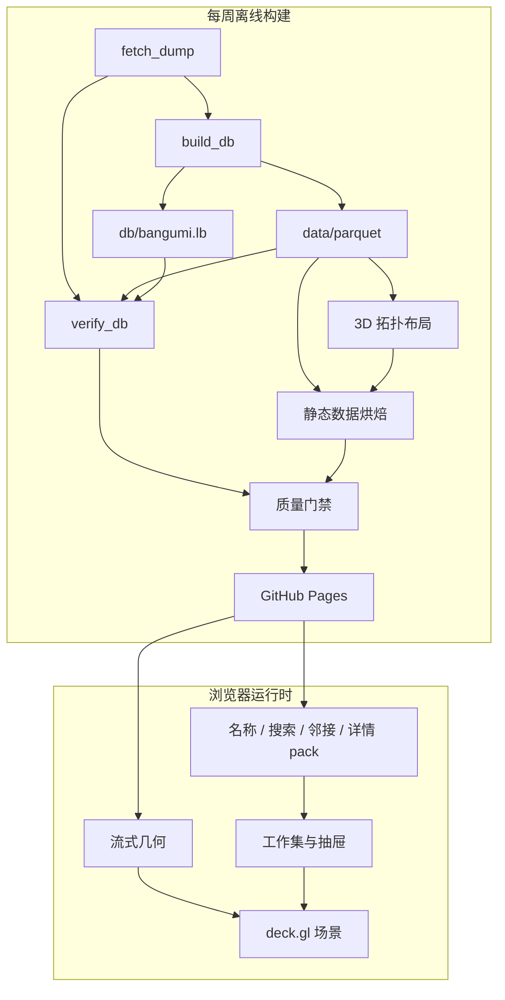

# 探索应用架构

本文记录“Bangumi 星图”的稳定产品边界、运行契约和设计理由。当前发布的节点数、
文件体积和构建耗时由生成产物记录，不在本文重复维护。底层数据管道见
[DATA_ARCHITECTURE.md](DATA_ARCHITECTURE.md)。

站点数据格式（结构核心、类型化事实、按需长文本侧车)与浏览器 Data
契约的权威定义见
[结构化站点数据与按需长文本设计](STRUCTURAL_SITE_DATA_DESIGN.md)；
本文描述交互、渲染与发布边界。

| 项目 | 设计 |
|---|---|
| 产品 | 作品、人物和角色的 3D 关系探索器 |
| 部署 | GitHub Pages 静态站点，无运行时后端 |
| 更新 | 每周全量构建并原子发布 |
| 原则 | 全图提供语境，小型工作集承载交互 |

## 产品边界与质量目标

目标环境是支持 WebGL 的桌面浏览器。移动端、实时更新、通用图查询控制台和无界邻居
展开不在当前范围内。首屏必须渐进呈现，后台加载不能阻塞交互，关系查询和绘制必须有界。
设备配置、耗时和帧率仅记录在可重复的测量报告中。当前 CI 尚未覆盖真实浏览器性能和
可访问性测试，因此未自动验证的数值不构成发布承诺。

## 系统架构

星图只包含 `Subject`、`Person` 和 `Character`。度通常为 1 的 `Episode` 只在
作品详情中展示。运行时分为完整的**语境层**和通常不超过数百节点的**工作集**；
后者承载高亮、关系和交互反馈。

布局、社区、邻接和搜索索引全部离线计算。浏览器只负责渲染、有限路径查询和静态
分片读取；GPU 承担节点拾取。可分享状态由 URL 和内容寻址的数据版本恢复。

| 数据 | 加载策略 |
|---|---|
| 七个几何 SoA（分列数组）文件 | 并行流式，首块到达即渲染 |
| `names.idx`、`names.pack` | 按 rank（热度顺序编号）分块读取，悬停、结果和关系视图按需缓存 |
| `manifest.json` | 启动时加载并验证数据契约 |
| `rank-by-key.bin` | 第一批节点绘制后低优先级加载 |
| 搜索字表与自适应前缀目录 | 搜索框聚焦时读取；输入后只读命中的一个前缀成员，启动不预取 |
| `edges.bin`、`labels.json` | 仍随发布产出;探索端当前不加载(边与名字只在选中态由工作集呈现) |
| 实体、事实、分集、文本 pack | 索引按需加载，成员经 HTTP Range 读取并进入分族计权 LRU；分页偏移由所属条目提供 |

发布产物的实际大小、文件数和当前托管预算以 `manifest.json` 与 workflow 为准。

### 技术选型

| 层 | 选型 | 理由 |
|---|---|---|
| 数据转换与数据库 | Python、Arrow、LadybugDB | 类型化列式转换和独立图查询产物 |
| 布局与站点烘焙 | Python、Arrow、igraph | 直接读取 Parquet 生成静态投影 |
| 3D 布局 | igraph UMAP-3D + 纵深压缩 | 相连节点趋近，同时保留地图式全局阅读 |
| 社区检测 | Leiden | 支持全图社区标签生成 |
| 渲染与拾取 | deck.gl | 直接消费 TypedArray，提供 GPU 拾取 |
| 客户端 | TypeScript strict | 明确手写的浏览器数据契约 |
| DOM 状态 | 原生 DOM + 微型 store | 界面状态和更新频率有限 |
| 构建与托管 | esbuild、Actions、Pages | 无后端，支持定时静态发布 |

仅在构建超出 CI 时限、前端状态显著增长或性能分析证明存在稳定瓶颈时复议对应
选型。尚未出现的需求不作为提前引入框架或 WASM 的理由。

## 交互与可访问性

### 探索与查询

探索循环是“定位 → 观察 → 扩展 → 连接”：搜索目标并飞行定位，通过空间聚簇和
标签理解语境，单击节点显示高热度关系，再用过滤、共同关联或最短路径比较节点。
同一邻居的多种关系分别保留边和标签，但封面只绘制一次。

| 查询 | 契约 |
|---|---|
| 节点关系 | 星图工作集按全局收藏度取前 50 条关系项；抽屉按关系组先显示 12 条，展开时先放开最多 200 条内联关系项，再分页读取溢出项 |
| 共同关联 | 两端各在最高热度的 200 条内联关系项中取唯一邻居后求交集，并保留两侧的首个关系标签 |
| 最短路径 | 有界双向 BFS：最多 6 跳、每层前沿 48、每节点扩展 48 |
| 过滤结果 | 年份、媒介、评分和标签组成谓词，结果按全局热度枚举 |

超过路径边界时明确显示“未找到”，不继续无界请求。视图中的媒介选择用于视觉
弱化，结果面板中的媒介选择用于筛选。

| 视图能力 | 行为 |
|---|---|
| 相机 | turntable 轨道相机，无 roll；支持自由平移、飞行、全图和俯视正交 |
| 拾取与预取 | GPU 拾取返回 rank；悬停名称按需，停留 150 ms 后低优先级预取实体与事实结构，不读取分集或文本 |
| 聚光与透视（X-ray） | 语境层降亮到约三成；工作集提亮、保持高对比并为遮挡部分绘制描边 |
| 过滤 | 可见性和颜色由着色器参数（shader uniform）计算，被过滤节点不可拾取 |
| 边与名字 | 默认不显示任何边和名字；选中后工作集显示相连关系边、节点名（亮白、节点上方）与关系名（品红、边中点），任何距离都可读 |
| 关系方向 | 边上 "▶" 箭头指向关系目标端并随相机转向；文案 "← " 前缀表示指向选中节点；亮度梯度的亮端为目标端 |
| 缩放 | `fitZoom` 只用于全图初始视角和复位；交互使用绝对世界空间层级（[-2, 10]），滚轮越过巡航上限后转为等速前进——放大倍率有顶、前进没有顶；其前提是烘焙期把坐标归一到规范世界跨度 |

节点聚焦使用固定的局部层级。滚轮放大以
光标下的节点为锚点，脱靶时回退到光标射线附近最近的可见节点；枢轴随放大向锚点三维
收敛，锚点钉在原屏幕像素上，缩放深度不会停滞。一次连续滚动锁定同一锚点（停顿或
光标移开后重新解析），避免逐事件换锚造成深度突进忽大忽小。指向真空或缩小时保持
当前枢轴，空平面永远不会成为新关注点。用户平移和 URL
恢复不受数据包围盒（bbox）限制；bbox 只用于全图取景和裁剪面计算。远裁剪面始终覆盖
从当前枢轴到整个布局包围盒的范围。

### URL 状态

URL 承载可分享状态：

| 参数 | 含义 |
|---|---|
| `c`、`o` | 相机位姿和正交模式 |
| `n` | 选中节点的稳定 key（由实体类型和 ID 组成） |
| `r` | rank 提示，仅用于未流式覆盖时的 Range 点查 |
| `q`、`f`、`fr` | 共同关联或最短路径模式及其稳定起点 |
| `y`、`m`、`s`、`t` | 年份、媒介、最低评分和标签过滤 |

离散导航写入浏览器历史，连续相机和过滤变化只更新当前项。恢复以稳定 key 为准。
如果所需几何尚未流式加载，浏览器先按 rank 提示执行 Range 点查并核对 key；核对成功
即可恢复。仍无法确认稳定身份时，暂缓恢复整个 URL 状态，待几何全部就绪后再一次性
恢复。

### 界面与输入

画布占满视口；左侧依次为搜索、筛选和结果，右侧为详情抽屉。抽屉先展示结构
结果——标题、统计、事实分组和 bgm.tv 外链，关系条目可直接切换节点；简介、
`infobox` 源码、分集列表和分集介绍只在用户展开时读取，长文本按纯文本转义并
分段渲染。

| 输入 | 结果 |
|---|---|
| 左键拖动 / 滚轮 | 平移 / 向光标附近几何收敛缩放，真空处原地缩放 |
| 右键拖动 | 轨道旋转 |
| `T` / `R` | 切换俯视正交 / 显示完整关系图 |
| 单击 / 双击节点 | 选中并显示邻居 / 飞行聚焦 |
| 单击空白或 `Esc` | 取消或退出当前状态 |
| 单击关系条目 | 沿关系移动到新节点 |
| `S` | 聚焦搜索框 |
| 浏览器后退 | 返回上一离散状态 |

主要控制均可键盘聚焦并具有可访问名称；搜索使用 combobox/listbox 语义，动画遵循
`prefers-reduced-motion`。作品、人物和角色分别使用 `#3d8ede`、`#e56a40` 和
`#27ab7c`，与背景的对比度不低于 3:1；类型同时以文字和图例表达，不依赖颜色
作为唯一通道。

## 数据与模块契约

通用完整性规则：

- `manifest.json` 是每次发布的数据入口；版本由上游版本和完整产物契约计算。
- 加载器在读取大文件前验证 3D 布局标记和 `positions.bin = n_nodes × 12`；
  不兼容产物立即要求重建。
- 完整文件必须匹配 manifest 中的字节数和 SHA-256；物理名必须由完整摘要和逻辑名组成。
- `206 Partial Content` 必须返回精确的范围、长度和总文件大小。
- 不支持 Range 的服务器只下载一次完整 pack，后续在内存中切片。
- 同一资源的并发加载共享 Promise；失败后清除缓存，允许显式重试。
- 解析、校验或网络错误进入可见错误通道，不转换为空结果。

Manifest 是 `structural-site-v1` 契约：schema、字段策略、来源、计数、限制、
布局报告，以及每个逻辑产物的字节数、SHA-256 和内容寻址物理名；内容身份是除自身外
规范内容的 SHA-256。每个数据 URL 使用完整文件摘要组成的不可变物理路径，字节未变的
文件可跨发布复用缓存。旧会话请求的对象若返回 404/410，或 Range 点查检测到
`Content-Range`、gzip 成员或文件摘要不符，则停止后续请求并显示刷新状态，不混用发布。

### 几何与名称

“收藏度”指收藏该实体的用户数：作品取五种收藏状态之和，人物和角色取
`collects`。几何记录按该指标降序排列，总计 25 字节/节点。

| 文件 | 类型 | 含义 |
|---|---|---|
| `positions.bin` | 3 × f32 | 布局生成的完整 x/y/z 坐标 |
| `year.bin` | u16 | 作品年份；未知或非作品为 0 |
| `key.bin` | u32 | `类型 << 24 | id` |
| `size.bin` | u8 | 收藏度的对数编码 |
| `flags.bin` | u8 | NSFW 标志、孤立节点标志和媒介枚举码位段 |
| `score.bin` | u8 | 评分乘以 10 |
| `tags.bin` | u32 | 前 32 个元标签的位图 |

浏览器将坐标字节直接映射为 `Float32Array`。定长记录支持按 rank 点查，但节点身份
始终由 key 验证。Canvas 绘制无需名称数据，因此首屏不必加载名称。

名称与几何记录的顺序一致，再按 manifest 声明的块大小独立 gzip 并写入 `names.pack`；
`names.idx` 保存累计偏移。浏览器只解压实际访问的块。生成 manifest 前，烘焙器会回读
全部块，核对索引端点、行数和行结构；任一不符即终止。

`edges.bin` 保存按重要性降序的 u32 端点对。烘焙器先保证连通节点至少有一条
候选边，再按度归一权重补充；客户端只消费满足近景条件的前缀。

### 事实、分集、文本与搜索

事实 incidence 按 `key % 8192` 分桶写入 `facts.pack`；每个节点内联热度最高的
200 条 incidence，溢出项写入 `pages.pack`。事实保留方向、角色、原始枚举码和
multiplicity；反向文案（`← 原关系`）、固定语义标签和颜色是 Scene Model 的显示
规则，由 `mappings.json` 解码生成，不写入数据事实。

实体结构（除名称与长文本外的字段）在 `entities.pack`，分集从属集合在
`episodes.pack`（每 Subject 内联 200 条 + 分页）。简介、`infobox` 源码、分集
介绍和事实备注是四类按需文本侧车，只在用户展开时读取；空值由结构存在位表达，
不触发网络请求。格式细节见
[STRUCTURAL_SITE_DATA_DESIGN.md](STRUCTURAL_SITE_DATA_DESIGN.md)。

搜索是规范化前缀的自适应树：叶成员压缩后不超过 64,000 字节，需要拆分的内部
前缀自带热度 top-12；自动补全是有界投影，不生成客户端不会消费的终端分页，完整名称
仍以 `names.pack` 为权威。中日韩文字（CJK）使用一个字符，拉丁文本转小写；简繁和日文
新旧字形由烘焙器生成单字映射，索引与客户端共用。工作集标签的名字来自
`names.pack` 按需补载，字符集由当前显示的字符串即时生成，有符号距离场（SDF）
图集随选中重建（工作集字符量级很小）；烘焙产物中的标签表与骨架边仍随
SiteRelease 发布，探索端当前不消费。

### 模块边界

| 模块 | 职责 |
|---|---|
| `layout.py` | UMAP-3D、纵深整形、Leiden 和几何质量报告 |
| `bake_site.py` | 几何、名称、实体、事实、分集、文本侧车、搜索、标签和 manifest |
| `verify_site.py` | SiteRelease 与 Parquet 的独立内容与门禁对账 |
| `scene.ts` / `camera.ts` | deck.gl 场景、可见性、拾取和相机 |
| `loader.ts` | 流式读取、Range、完整性校验、分族计权 LRU 与发布切换检测 |
| `data.ts` | 语义与文本数据的唯一入口(实体/事实/分集/长文本) |
| `store.ts` / `url.ts` | 可观察状态与浏览器历史 |
| `search.ts` / `drawer.ts` | 搜索和详情交互 |
| `labels.ts` | 工作集标签图层(节点名/关系名/方向箭头)与 CPU 去重叠 |

Python 与 TypeScript 各自维护数据契约类型。修改 manifest 或二进制格式时必须同步
更新两侧实现和契约测试。

## 关键架构决策

### 范围

- **桌面地图语义优先**：拓扑决定三个坐标轴，再压缩纵深；俯视时仍是可读地图，
  倾斜后以视差、遮挡和聚光表达层次。节点保持连续空间布局，不引入人为定义的
  语义楼层。
- **Episode 不进入星图**：叶节点会显著增加规模而不扩展大多数路径；若上游增加
  分集级 staff 或角色关系，再评估按需展示。
- **孤立节点使用外围光环**：无边节点没有结构位置，按类型和年份放置并默认降亮，
  但仍可搜索和定位。

### 布局与渲染

- **每次独立布局**：每次发布只根据当前图运行 UMAP-3D。主成分确定地图朝向，第三
  轴根据稳健横向跨度压缩为克制的纵深，整体尺寸按节点数统一标定。连续坐标保留局部
  密度，孤立节点进入外围光环。布局不读取历史坐标，也不约束跨版本位移。可分享状态
  依赖稳定的实体 key，与节点位置无关。
- **稳定语境渲染**：完整节点集常驻 GPU，视口裁剪自然决定屏幕内的节点。zoom
  不参与节点显隐或亮度计算。语境层用屏幕像素上下限控制全图密度；搜索、聚焦、
  路径和独立工作集的持久节点使用同一空间坐标与世界尺寸，只设远景最小可见尺寸，
  近景随相机投影自然放大。普通节点中心保持不透明，孤立、过滤和聚光的亮度通过
  RGB 向背景色混合表达，避免半透明节点在远景叠亮、近景分离后显暗。扩散环等瞬时
  反馈才使用固定像素尺寸。
- **骨架边优先覆盖**：先保证连通节点有候选边，再由客户端近景条件和 12 万条上限
  控制开销。候选边总量与覆盖率冲突时，优先保证覆盖率。
- **线性 SoA 而非 3D Tiles**：当前几何可完整驻留 GPU；规模增长约一个数量级或
  首屏预算缩短到 2 秒时再考虑分层细化。
- **运行时生成 SDF**：deck.gl `TextLayer` 不支持直接注入外部图集，因此只在离线阶段
  确定字符集，图集则在首屏后生成；只有性能分析证明其成为瓶颈时才定制管线。
- **使用固定空间层级**：远景聚合由空间密度和分级标签表达，无需为展开或合并新增
  空间层级和 URL 状态。

### 数据交付与可选媒体

- **gzip 成员 pack**：独立压缩分片后合并，通过偏移索引执行 Range 读取，以少量
  文件换取会话内缓存；不支持 Range 时回退到一次完整下载。
- **封面是可选增强**：底层类型色圆点始终存在。WebGL 工作集请求带 CORS 的
  `small` 缩放图，普通 DOM 关系头像使用 `grid`，抽屉使用 `small`；单图失败只
  移除图片。需要强一致图片时改用本地烘焙或同源代理。
- **控制表现层范围**：保留空间聚簇、NSFW 数据位和 URL 分享；社区着色、独立
  NSFW 开关和节点分享卡片收益较低，暂不纳入。

## 发布、验证与测量

### 质量门禁

Pages 只接收 Actions 生成的构建产物；上游数据和中间产物不写入 Git 历史。

| 触发 | 门禁 |
|---|---|
| Push | Python 测试、Ruff lint/格式、mypy、Web 单测、TypeScript、生产构建 |
| Pull Request | Push 门禁，以及新增依赖的 high/critical 漏洞审查 |
| 每周发布 | 上述构建门禁、源枚举漂移、数据库与 SiteRelease 独立对账、真实三维布局报告、本地 HTTP 端到端 smoke 和完整 staging 体积 |

`bake_site.py` 默认拒绝随机测试布局；`--allow-stub` 只用于本地预览。

仓库设置应保护 `main`：必须经 Pull Request 并要求 `python`、`web` 和
`dependency-review` 状态通过，禁止 force push；CodeQL 使用 GitHub 默认设置扫描
Python 和 JavaScript/TypeScript。这两项属于 GitHub 仓库设置，不由工作流文件自行开启。

这些门禁验证数据与构建正确性，但不包含真实浏览器性能和可访问性测试。相关目标只能
通过独立测量验证，报告必须注明设备、数据版本和方法。不能仅凭单元测试通过，就认定
这些目标已经达到。

站点超过 Pages 体积门禁时构建失败；实际流量接近托管配额前迁移到
Cloudflare Pages/R2，需要服务端计算时再评估 Workers。

### 测量来源

易变化的发布数据只维护在生成源中：

| 来源 | 权威内容 |
|---|---|
| `site/data/manifest.json` | 数据版本、节点数、产物大小与数量、布局摘要 |
| `data/layout/report.json` | 当前布局算法、纵深比、投影邻距和边紧凑度 |
| Actions 构建日志 | 各阶段耗时和门禁结果 |

## 开放风险

| 风险 | 当前控制 | 后续动作 |
|---|---|---|
| 持续帧率随设备和视角变化 | 边上限、DPR 上限 | 定期在基准设备采样 |
| Pages 体积或带宽不足 | Range、按需加载和硬体积门禁 | 推广前按实测迁移 R2 |
| 默认域名可能变化 | URL 状态不依赖域名 | 确定正式域名后重定向 |
| 官方封面可用性和 CORS 变化 | CORS 缩放图和类型圆点回退 | 强一致需求改为本地或同源图片 |
