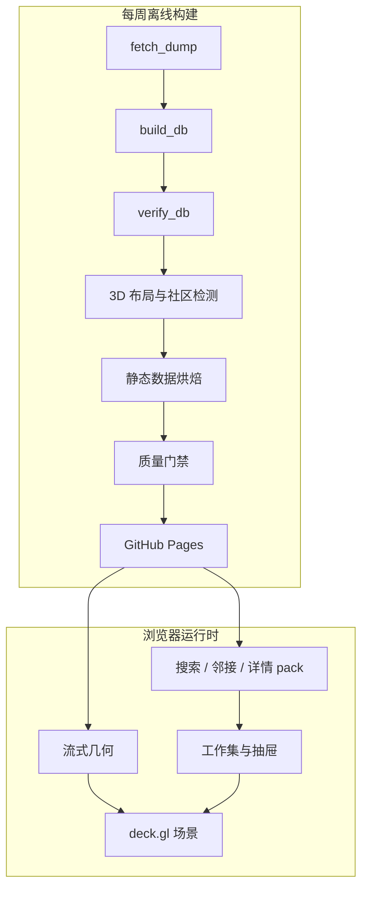

# 探索应用架构

本文记录“Bangumi 星图”的稳定产品边界、运行契约和设计理由。当前发布的节点数、
文件体积和构建耗时由生成产物记录，不在本文重复维护。底层数据管道见
[DATA_ARCHITECTURE.md](DATA_ARCHITECTURE.md)。

| 项目 | 设计 |
|---|---|
| 产品 | 作品、人物和角色的三维关系探索器 |
| 部署 | GitHub Pages 静态站点，无运行时后端 |
| 更新 | 每周全量构建并原子发布 |
| 原则 | 全图提供语境，小型工作集承载交互 |

## 产品边界与质量目标

目标环境是配备近五年独立或集成 GPU 的桌面浏览器，以 Apple Silicon Mac 和
Chrome 作为性能基准。移动端、低端设备、实时更新、通用图查询控制台和无界邻居
展开不在当前范围内。

| 场景 | 预算 |
|---|---:|
| 首块数据可交互 | 小于 5 秒 |
| 全量几何后台加载 | 小于 30 秒，不阻塞交互 |
| 单击节点到邻居高亮 | 小于 300 毫秒 |
| 已缓存搜索分片的联想 | 小于 100 毫秒 |
| 冷搜索分片的 p95 | 小于 400 毫秒 |
| 全图渲染 | 不低于 30 fps |

渲染预算以设备像素比上限 1.5 为前提。测量结果属于发布报告，不是所有设备和
视角的固定承诺。

## 系统架构

星图只包含 `Subject`、`Person` 和 `Character`。度通常为 1 的 `Episode` 只在
作品详情中展示。运行时分为完整的**语境层**和通常不超过数百节点的**工作集**；
后者承载高亮、关系和交互反馈。



布局、社区、邻接和搜索索引全部离线计算。浏览器只负责渲染、有限路径查询和静态
分片读取；GPU 承担节点拾取。可分享状态由 URL 和内容寻址的数据版本恢复。

| 数据 | 加载策略 |
|---|---|
| 七个几何 SoA 文件、`names.ndjson` | 并行流式，首块到达即渲染 |
| `edges.bin` | 随首屏加载，近景只显示有界子集 |
| 邻接、详情、搜索和分页 pack | 按索引执行 HTTP Range 请求 |
| manifest、标签和索引 | 启动或后台空闲阶段加载 |
| `coords.parquet` | 仅供下周布局热启动，不进入首屏 |

发布产物的实际大小和文件数以 `manifest.json` 为准；构建硬限制为 1 GB。

### 技术选型

| 层 | 选型 | 理由 |
|---|---|---|
| 数据与烘焙 | Python、Arrow、LadybugDB | 复用图算法与列式数据生态 |
| 三维布局 | igraph UMAP-3D | 满足全图规模、热启动和三维坐标要求 |
| 社区检测 | Leiden | 支持全图并可按成员重叠跨周对齐 |
| 渲染与拾取 | deck.gl | 直接消费 TypedArray，提供 GPU picking |
| 客户端 | TypeScript strict | 明确手写的浏览器数据契约 |
| DOM 状态 | 原生 DOM + 微型 store | 界面状态和更新频率有限 |
| 构建与托管 | esbuild、Actions、Pages | 无后端，支持定时静态发布 |

仅在构建超出 CI 时限、前端状态显著增长或 profiler 证明存在稳定瓶颈时复议对应
选型，不为假设需求提前引入框架或 WASM。

## 交互与可访问性

### 探索与查询

探索循环是“定位 → 观察 → 扩展 → 连接”：搜索目标并飞行定位，通过空间聚簇和
标签理解语境，单击节点显示高热度关系，再用过滤、共同关联或最短路径比较节点。
同一邻居的多种关系分别保留边和标签，但封面只绘制一次。

| 查询 | 契约 |
|---|---|
| 节点关系 | 默认显示全局收藏度最高的 50 条；其余内容分页读取 |
| 共同关联 | 两端各取最高热度的 200 个邻居后求交集，并保留两侧关系标签 |
| 最短路径 | 有界双向 BFS：最多 6 跳、每层前沿 48、每节点扩展 48 |
| 过滤结果 | 年份、媒介、评分和标签组成谓词，结果按全局热度枚举 |

超过路径边界时明确显示“未找到”，不继续无界请求。视图中的媒介选择用于视觉
弱化，结果面板中的媒介选择用于筛选。

| 三维能力 | 行为 |
|---|---|
| 相机 | turntable 轨道相机，无 roll；支持飞行、复位和俯视正交 |
| 拾取与预取 | GPU picking 返回 rank；悬停时预取邻接和详情 |
| 聚光与 X-ray | 语境层降亮；工作集保持高对比并为遮挡部分绘制描边 |
| 过滤 | 可见性和颜色由 shader uniform 计算，被过滤节点不可拾取 |
| 骨架边 | 远景隐藏；近景只显示目标附近、双端可见的边，最多 12 万条 |
| 缩放 | `fitZoom` 只用于全图初始视角和复位；交互使用绝对世界空间层级 |

相机和过滤条件不变时不重建边可见集。节点聚焦使用固定的局部层级；滚轮、
飞行和 URL 恢复不受全图适配层级限制。

### URL 状态

URL 是可分享状态：

| 参数 | 含义 |
|---|---|
| `c`、`o` | 相机位姿和正交模式 |
| `n` | 选中节点的稳定 key |
| `r` | rank 提示，仅用于未流式覆盖时的 Range 点查 |
| `q`、`f`、`fr` | common/path 模式及其稳定起点 |
| `y`、`m`、`s`、`t` | 年份、媒介、最低评分和标签过滤 |

离散导航写入浏览器历史，连续相机和过滤变化只更新当前项。恢复以稳定 key 为准；
所需几何未加载时挂起完整状态，而不是降级为普通选择。

### 界面与输入

画布占满视口；左侧依次为搜索、筛选和结果，右侧为详情抽屉。抽屉展示标题、
统计、简介、关系、分集和 bgm.tv 外链，关系 chip 可直接切换节点。初始状态缓慢
自转，首次交互后停止。

| 输入 | 结果 |
|---|---|
| 左键拖动 / 滚轮 | 平移 / 推拉 |
| 右键拖动 | 轨道旋转 |
| `T` / `R` | 俯视正交 / 相机复位 |
| 单击 / 双击节点 | 选中并显示邻居 / 飞行聚焦 |
| 单击空白或 `Esc` | 取消或退出当前状态 |
| 单击关系 chip | 沿关系移动到新节点 |
| `S` | 聚焦搜索框 |
| 浏览器后退 | 返回上一离散状态 |

主要控制均可键盘聚焦并具有可访问名称；搜索使用 combobox/listbox 语义，动画遵循
`prefers-reduced-motion`。作品、人物和角色分别使用 `#3d8ede`、`#e56a40` 和
`#27ab7c`，与背景的对比度不低于 3:1；类型同时以文字和图例表达，不依赖颜色
作为唯一通道。

## 数据与模块契约

通用完整性规则：

- `manifest.json` 是每次发布的数据入口；版本由上游版本和完整产物契约计算。
- 完整文件必须匹配 manifest 中的字节数和 SHA-256。
- `206 Partial Content` 必须返回精确的范围、长度和总文件大小。
- 不支持 Range 的服务器只下载一次完整 pack，后续在内存中切片。
- 同一资源的并发加载共享 Promise；失败后清除缓存，允许显式重试。
- 解析、校验或网络错误进入可见错误通道，不转换为空结果。

Manifest 包含 dump 与内容版本、节点和分桶参数、年份范围、布局报告、标签与搜索
清单，以及每个产物的字节数和 SHA-256。加载后所有数据请求都携带内容版本，避免
不同发布的缓存混用。

### 几何与名字

“收藏度”指收藏该实体的用户数：作品取五种收藏状态之和，人物和角色取
`collects`。几何记录按该指标降序排列，总计 19 字节/节点。

| 文件 | 类型 | 含义 |
|---|---|---|
| `positions.bin` | 3 × u16 | 三维量化坐标 |
| `year.bin` | u16 | 作品年份；未知或非作品为 0 |
| `key.bin` | u32 | `类型 << 24 | id` |
| `size.bin` | u8 | 收藏度的对数编码 |
| `flags.bin` | u8 | NSFW、孤立节点和媒介位图 |
| `score.bin` | u8 | 评分乘以 10 |
| `tags.bin` | u32 | 前 32 个元标签的位图 |

浏览器将坐标反量化为 Float32。定长记录支持按 rank 点查，但节点身份始终由 key
验证。`names.ndjson` 与几何同序，流式解析完成后校验完整 SHA-256。

`edges.bin` 保存按重要性降序的 u32 端点对。烘焙器先保证连通节点至少有一条
候选边，再按度归一权重补充；客户端只消费满足近景条件的前缀。

### 邻接、详情与搜索

邻接按 `key % 8192` 分桶，每桶独立 gzip 后合入 `adj.pack`，`adj.idx` 保存偏移。

```text
{
  g: [labelId, groupTotal, inlineRanks][],
  n: total,
  op?: [offset, length][]
}
```

每个节点整体内联最高热度的 200 个邻接项，溢出项写入 `pages.pack`。源关系方向
不变；导航补充的反向关系使用 `← 原关系`，不声称源数据互惠。重复关系行去重并
计数。

详情分散到 `det-0.pack` 至 `det-3.pack`，包含短属性、完整简介和作品分集；超过
200 集的部分进入 `pages.pack`，未解析的 `infobox` 不发布到站点。

搜索按首字符分片。CJK 使用一个字符，拉丁文本转小写；简繁和日文新旧字形由
烘焙器生成单字映射，索引与客户端共用。标签只覆盖高热度节点和社区代表标签，
字符集离线确定，SDF 图集在首屏后由 deck.gl 生成。

### 模块边界

| 模块 | 职责 |
|---|---|
| `layout.py` | UMAP-3D、Leiden、跨周对齐、孤立节点外壳和位移报告 |
| `bake_site.py` | 几何、名字、邻接、详情、搜索、标签和 manifest |
| `scene.ts` / `camera.ts` | deck.gl 场景、可见性、拾取和相机 |
| `loader.ts` | 流式读取、Range、完整性校验和缓存 |
| `store.ts` / `url.ts` | 可观察状态与浏览器历史 |
| `search.ts` / `drawer.ts` | 搜索和详情交互 |
| `labels.ts` | 标签图层和碰撞剔除 |

Python 与 TypeScript 各自维护数据契约类型。修改 manifest 或二进制格式时必须同步
更新两侧实现和契约测试。

## 关键架构决策

### 范围

- **桌面三维优先**：三维承载全图结构，接受移动端覆盖和部分二维分析效率的损失；
  聚光、雾、屏幕空间尺寸和俯视正交用于缓解可读性问题。
- **Episode 不进入星图**：叶节点会显著增加规模而不扩展大多数路径；若上游增加
  分集级 staff 或角色关系，再评估按需展示。
- **孤立节点使用外围球壳**：无边节点没有结构位置，按类型和年份放置并默认降亮，
  但仍可搜索和定位。

### 布局与渲染

- **布局冻结并热启动**：以上周坐标为 seed，执行 UMAP 后用 Procrustes 对齐；
  社区 ID 按成员重叠对齐。跨周 p95 位移超过 3% 时阻断发布，首次冷启动需显式允许。
- **骨架边优先覆盖**：先保证连通节点有候选边，再由客户端近景条件和 12 万条上限
  控制开销，不为满足固定总量牺牲覆盖率。
- **线性 SoA 而非 3D Tiles**：当前几何可完整驻留 GPU；规模增长约一个数量级或
  首屏预算缩短到 2 秒时再考虑分层细化。
- **运行时生成 SDF**：deck.gl `TextLayer` 不支持直接注入外部图集，因此离线确定
  字符集、首屏后生成图集；只有 profiler 证明其成为瓶颈时才定制管线。
- **不提供展开或合并**：空间密度和分级标签表达远景聚合，避免新增 URL 和跨周
  位置一致性状态。

### 数据交付与可选媒体

- **gzip 成员 pack**：独立压缩分片后合并，通过偏移索引执行 Range 读取，以少量
  文件换取会话内缓存；不支持 Range 时回退到一次完整下载。
- **封面不参与正确性**：底层类型色圆点始终存在。WebGL 工作集请求带 CORS 的
  `small` 缩放图，普通 DOM 关系头像使用 `grid`，抽屉使用 `small`；单图失败只
  移除图片。需要强一致图片时改用本地烘焙或同源代理。
- **删除低收益表现层功能**：不使用难以区分的社区着色，不提供独立 NSFW 开关或
  节点分享卡片；保留空间聚簇、NSFW 数据位和 URL 分享。

## 发布、验证与测量

### 质量门禁

Pages 只接收 Actions 生成的 artifact；上游数据和中间产物不写入 Git 历史。

| 触发 | 门禁 |
|---|---|
| Push / Pull Request | Python 测试、Ruff、mypy、Web 单测、TypeScript、生产构建 |
| 每周发布 | 上述门禁，以及内容指纹、布局位移、体积和真实浏览器探针 |

浏览器探针验证无 console/page/request 错误、画布真实像素、筛选与导航流程、URL
重载和可访问性树。第三方封面使用确定性响应，不让外部可用性决定发布结果。

站点超过 Pages 体积门禁时构建失败；实际流量接近托管配额前迁移到
Cloudflare Pages/R2，需要服务端计算时再评估 Workers。

### 测量来源

易变化的发布数据只维护在生成源中：

| 来源 | 权威内容 |
|---|---|
| `site/data/manifest.json` | 数据版本、节点数、产物大小与数量、布局摘要 |
| `data/layout/report.json` | 布局算法、热启动状态和跨周位移 |
| Actions 构建日志 | 各阶段耗时、门禁结果和浏览器探针输出 |

真实 Chrome 探针覆盖首屏、三类节点、标签、选中、飞行、抽屉、X-ray、近景边、
过滤、共同关联和 URL 重载。本文只保存门禁契约，不复制某次发布的测量快照。

## 开放风险

| 风险 | 当前控制 | 后续动作 |
|---|---|---|
| 跨周位移样本不足 | p95 超过 3% 阻断发布 | 持续观察每周报告 |
| 持续帧率随设备和视角变化 | 边上限、DPR 上限、像素探针 | 定期在基准设备采样 |
| Pages 体积或带宽不足 | Range、按需加载和硬体积门禁 | 推广前按实测迁移 R2 |
| 默认域名可能变化 | URL 状态不依赖域名 | 确定正式域名后重定向 |
| 官方封面可用性和 CORS 变化 | CORS 缩放图和类型圆点回退 | 强一致需求改为本地或同源图片 |
