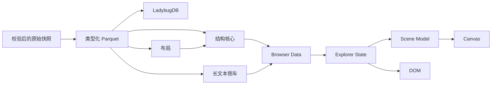

# 结构化站点数据与按需长文本设计

> 状态：已实现。格式契约见 [`scripts/site_release.py`](../scripts/site_release.py)，
> 烘焙见 [`scripts/bake_site.py`](../scripts/bake_site.py)，独立验证见
> [`scripts/verify_site.py`](../scripts/verify_site.py)，浏览器数据入口见
> [`web/src/data.ts`](../web/src/data.ts)。管道与交互边界另见
> [数据管道与图模型](DATA_ARCHITECTURE.md) 与
> [探索应用架构](EXPLORER_ARCHITECTURE.md)。

本设计把静态探索器的数据分成同一 SiteRelease 内的两层：结构核心保存可查询的实体、
事实和分集语义；长文本侧车保存简介、分集介绍、事实备注和原始 `infobox` Wiki 源码。
两层来自同一份类型化 Parquet、共享同一内容版本，但只有结构核心参与首屏、关系查询
和 Canvas。

## 1. 目标与边界

目标：

- 保留类型化 Parquet 中的全部实体、事实、分集和字段值。
- 关系保留方向、参与角色、原始枚举码、附加属性和重复次数，不降级成展示字符串。
- 实体简介、`infobox`、分集介绍和事实备注完整保存为按需文本侧车，不混入结构桶。
- 首屏只加载几何等必需数据；悬停和 Canvas 不读取长文本。
- 复用独立 gzip 成员、HTTP Range 和静态托管，不引入运行时数据库、WASM 或后端。
- 完整 `site/` 发布目录不超过项目现行的 1,000,000,000 字节门禁；容量余量优先用于
  缩短首屏、搜索、选中和文本展开延迟，而不是追求没有产品收益的最小字节数。

不在范围内：

- 还原上游 JSONL 的原始字节、字段顺序、空值写法或来源记录位置。
- 解析、执行或自动渲染 `infobox` Wiki 源码；SiteRelease 只保存并按纯文本提供原字符串。
- 在浏览器中提供任意 Cypher、全图无界遍历或 LadybugDB 的执行能力。
- 把 Episode 加入全局星图；Episode 仍是作品详情中的结构化从属记录。
- 通过截断文本、按长度删记录或构建时临时取消字段来通过门禁。

因此，SiteRelease 能恢复当前类型化 Parquet 的字段语义，但不是原始快照的字节级副本，
也不提供 LadybugDB 的存储布局和查询执行能力。

## 2. 数据边界



| 层 | 权威内容 | 允许的损失 |
|---|---|---|
| 原始快照 | 经 SHA-256 校验的上游字节 | 无 |
| 类型化 Parquet | 当前 schema 下的实体、事实和规范化字段 | 已声明的空值归一和悬空边过滤 |
| LadybugDB | Parquet 的图查询投影 | 受图端点约束 |
| SiteRelease 结构核心 | 字段策略中的结构实体、事实和分集 | 文本侧车字段、来源字节和数据库执行能力 |
| SiteRelease 文本侧车 | 字段策略声明的完整原始字符串值 | 字段值无损；不保留上游 JSON 编码和 Wiki 解释结果 |
| Scene Model | 当前交互所需的有限节点和边 | 查询预算之外的数据 |
| Canvas | 几何、颜色、拾取和当前可绘制场景 | 所有文本及不参与当前画面的语义 |

结构核心和文本侧车合起来才是本设计的 SiteRelease。二者必须来自同一 dump 并受同一
manifest 约束，不能混用不同发布版本。LadybugDB 与 SiteRelease 是 Parquet 的并列产物；
站点构建不读取数据库文件，原始快照仍是重新解释数据的唯一依据。

## 3. 字段策略

发布配置名为 `explorer-v1`。每个源字段必须显式标记为 `core`、`sidecar` 或 `omitted`，
禁止使用“字符串超过多少字符就删除”之类的数据相关规则。

### 3.1 核心实体

| 实体 | 结构核心 | 文本侧车 |
|---|---|---|
| Subject | `id`、`type`、`name`、`name_cn`、`platform_code`、`date`、`score`、`rank`、`nsfw`、五种收藏计数、`series`、`score_details`、`meta_tags`、`tags` | `summary`、`infobox` |
| Person | `id`、`name`、`type`、`career`、`comments`、`collects` | `summary`、`infobox` |
| Character | `id`、`name`、`role`、`comments`、`collects` | `summary`、`infobox` |

`type_name`、`platform` 等解码值不在每条实体中重复保存。`position_cn`、`role_cn` 和
`relation` 也不在每条事实中重复保存。站点保留原始码，并通过带版本和摘要的
`mappings.json` 生成显示文本。未知码仍以原始数值存在，不能因缺少标签而丢弃记录。
映射键必须包含事实种类和所需命名空间，不能假设不同媒介下的相同数值语义相同。

短字符串仍按原值保留，例如名称、日期、`duration`、`career` 和 `appear_eps`。它们有
结构语义，不能为了压缩而改写或推断。

源字段 `Subject.rank` 在 Browser Data 中命名为 `bgmRank`。下文的 `VisualRank` 专指
当前发布的几何数组下标，两者不能混用。

### 3.2 Episode 从属集合

Episode 在 LadybugDB 中仍是节点；在 SiteRelease 中，它是 Subject 的分页多值属性。
当前 schema 下，每个 Episode 只通过 `subject_id` 归属一个 Subject，不参与其他关系，
也不进入 Canvas。把这样的叶节点收缩为从属记录，不改变核心图连通性。

结构记录保留 `id`、`name`、`name_cn`、`airdate`、`disc`、`duration`、`sort`、`type` 和
`subject_id`；`description` 进入文本侧车。结构记录按 SubjectKey 分组写入
`episodes.pack`，因此不重复存储 `subject_id`；Data 返回时从分组键恢复它。所属 Subject
已删除的孤儿分集仍按原始 SubjectKey 分组并计数，不能丢弃。

Episode 保留独立的 `u32 EpisodeId`，但没有 EntityKey、实体索引或 `EPISODE_OF` 事实。
文本侧车以 SubjectKey 分组并在组内按 EpisodeId 寻址；多个相邻 Subject 共享物理成员，
这不要求 Episode 进入核心图。

### 3.3 事实

| 事实 | 结构角色与属性 | 文本侧车 |
|---|---|---|
| `RELATES_TO` | `source: Subject`、`target: Subject`、`relation_type`、`sort_order` | 无 |
| `WORKED_ON` | `person: Person`、`subject: Subject`、`position`、`appear_eps` | 无 |
| `APPEARS_IN` | `character: Character`、`subject: Subject`、`type`、`sort_order` | 无 |
| `VOICE_CREDIT` | `person: Person`、`character: Character`、`subject_context: Subject`、`type` | `summary` |
| `PERSON_REL` | `source: Person`、`target: Person`、`relation_type`、`spoiler`、`ended` | 无 |
| `CHARACTER_REL` | `source: Character`、`target: Character`、`relation_type`、`spoiler`、`ended` | 无 |

`VOICE_CREDIT` 对应当前数据库的 `VOICED`。作品上下文是事实参与者而不是普通展示属性；
即使该 Subject 已删除，也保留这个未解析引用。当前快照的 `VOICED.summary` 全部为空，
所以不产生文本负载；schema 仍保留该字段，未来出现非空值时以 FactRef 寻址。

关系方向由角色字段表达，不能编码成 `"← 关系名"`。反向文案、颜色和线型都是
Scene Model 的显示规则，不是数据事实。

磁盘上把完整事实放在参与实体的索引项下，形式上类似“关系数组属性”；这是允许的物理
降级。解码后它仍是带角色和属性的 Fact，不能只剩邻居 ID 或展示标签。

### 3.4 长文本规则

- `summary`、Episode `description`、`VOICE_CREDIT.summary` 和实体 `infobox` 都进入侧车。
- 每个字段族使用 `text.idx` 中的独立索引区段和独立 pack；展开简介不会顺带下载
  `infobox`，反之亦然。
- 侧车保存 Parquet 中的完整字符串，不摘要、不截断、不改写标记。
- 空字符串不写入 gzip 成员；结构记录中的存在位允许 Data 无请求地返回 `empty`。某类
  文本全空时仍在 `text.idx` 生成规范空目录和零长度 pack，不能靠缺文件表达“没有内容”。
- `infobox` 是未解析且不可信的 Wiki 源码；浏览器只能转义后按纯文本显示，不能把它当
  HTML 执行，也不能用有损解析结果代替原字符串。
- 当前 `explorer-v1` 不省略类型化 Parquet 的任何字段；`omitted` 仅保留为未来 schema
  演进时必须显式声明的策略值。
- manifest 声明为 `sidecar` 的字段必须随该次发布完整存在。体积超限时构建失败，不能
  静默改成 `omitted`。
- 将来增减文本字段必须定义新的显式 profile；不能让同名 profile 随数据规模改变语义。

## 4. 身份、重复与完整性

### 4.1 EntityKey 与 VisualRank

所有核心实体使用稳定的 32 位键：

```text
EntityKey = kind << 24 | source_id
kind: Subject=1, Person=2, Character=3
```

构建必须断言 `0 <= source_id < 2^24`；不满足时阻断发布并升级格式，不能截断 ID。
站点内部的所有核心实体引用都编码为 EntityKey；源 `*_id` 可由低 24 位无损取回。
`VisualRank` 只是当前发布内的几何顺序，不能写入事实或 URL 作为身份。

`key.bin` 提供 `VisualRank -> EntityKey`。反向索引 `rank-by-key.bin` 按实体种类拼接从 0 到
该类最大 ID 的三字节无符号数组，空位为 `0xffffff`；各段字节偏移和上界写入 manifest。
构建必须断言最大 VisualRank 小于 `0xffffff`，否则升级格式。该索引只覆盖进入 Canvas 的
核心实体，避免浏览器建立大型 JS Map 或线性扫描；三字节解码不进入 Canvas 的逐节点
热路径。

### 4.2 FactRef 与重复行

完整事实由“事实种类 + 带角色的参与者 + 全部语义属性”组成。构建对规范编码排序，为
每个不同事实分配确定的发布内 `u32 FactRef`。`FactRef` 只用于同一 SiteRelease 内去重，
不进入 URL，也不承诺跨发布稳定。

物理侧车不改变事实身份：`VOICE_CREDIT.summary` 仍参与事实规范编码。两行仅该字段不同
时是两个事实，不能因为文本另存而合并。完全相同的 Parquet 行可以合并，但必须保存
`multiplicity`；参与者、方向或任一属性不同，都必须是不同事实。

为保证一次选中只需读取一个事实桶，每个事实在每个不同参与者 EntityKey 下保存一条
incidence 元组。桶键就是当前参与者，因此元组只保存它的角色、其他参与者和完整结构
属性；自环用角色位图表示并只存一条。Data 补回桶键后，各 incidence 必须还原为同一个
规范事实并共享同一 FactRef。跨节点合并结果时按 FactRef 去重。

实体 `summary` 和 `infobox` 不参与 EntityKey，Episode `description` 不参与 EpisodeId；
它们分别以现有实体和分集身份寻址。事实文本以 FactRef 寻址，从而不会把关系备注错误
归到 Person 或 Character 上。

## 5. 发布格式

沿用“每块独立 gzip，再把成员合并为 pack，索引保存偏移，浏览器用 HTTP Range 取片”
的现有机制。一个巨大的单成员 `.gz` 无法随机读取，不允许作为长文本格式。结构数据按
查询键分桶；长文本按实体种类和连续源 ID 范围分块，避免哈希桶过小导致压缩上下文反复
重置。字段使用各自的块宽和压缩级别，不设一个全局桶数。

结构压缩按四层完成，并且每层都必须可逆：

1. **消除结构冗余**：分组键、实体键和事实种类能够推导的值不重复保存。
2. **共享重复词汇**：`career`、`meta_tags` 和 `tags.name` 使用发布内词表 ID；API 解码后
   仍返回原字符串。
3. **紧凑元组**：固定字段顺序代替对象键，固定集合和布尔值使用定长数组或位图。
4. **独立压缩与按需读取**：确定性排序后，每块独立 gzip，再合并为 Range pack。

JSON 使用无额外空白的 UTF-8 编码；gzip 固定 `mtime=0`。相同 schema、输入、映射和参数
必须产生相同成员字节，文件摘要才能作为跨周缓存身份。

压缩不能依赖脏数据解析。日期、`duration` 和 `appear_eps` 继续保存原始字符串；不把它们
强制转换成时间或分集范围。

| 产物 | 职责 |
|---|---|
| `manifest.json` | schema、字段策略、来源、计数、限制和所有文件摘要 |
| 现有几何 SoA | `positions`、`year`、`key`、`size`、`flags`、`score`、`tags` |
| `rank-by-key.bin` | 稳定键到 Canvas VisualRank 的紧凑反向索引 |
| `names.idx` / `names.pack` | 核心实体 `name` 与 `name_cn` 的规范副本，每 2,048 个 VisualRank 一个初始成员 |
| `entities.idx` / `entities.pack` | 核心实体除 `name`、`name_cn` 和长文本外的字段 |
| `facts.idx` / `facts.pack` | 按参与实体查询的完整类型化事实结构 |
| `episodes.idx` / `episodes.pack` | 按 SubjectKey 分组的 Episode 结构记录，包括孤儿分组 |
| `text.idx` | 四类文本的字段目录、身份范围、成员偏移和长度 |
| `entity-summary-*.pack` | EntityKey → `summary` |
| `entity-infobox-*.pack` | EntityKey → `infobox` 原字符串 |
| `episode-description-*.pack` | SubjectKey → `[EpisodeId, description]` |
| `fact-summary-*.pack` | FactRef → `VOICE_CREDIT.summary` |
| `pages.pack` | 高度节点的事实页和长分集列表页，不存长文本 |
| `vocab.pack` | `career`、`meta_tags` 和 `tags.name` 的精确字符串词表 |
| `mappings.json` | 原始枚举码到显示文本的版本化映射 |
| 搜索与标签产物 | 自适应前缀名称检索、字符折叠和空间标签 |
| `edges.bin` | 仅用于全局语境的抽样骨架，不是事实权威 |

`explorer-v1` 使用下列初始分块；范围边界和 gzip 参数都写入 manifest，客户端不能猜测：

| 数据 | 初始分块 | gzip |
|---|---:|---:|
| 名称 | 2,048 个连续 VisualRank | 6 |
| 实体结构 | 每种实体 256 个连续源 ID | 9 |
| Episode 结构 | 128 个连续 Subject ID；每 Subject 内联 200 条，溢出每页 500 条 | 9 |
| 事实 incidence | 8,192 个稳定键桶；每实体内联 200 条，溢出每页 500 条 | 6 |
| Entity `summary` | 每种实体 128 个连续源 ID | 9 |
| Entity `infobox` | 每种实体 256 个连续源 ID | 9 |
| Episode `description` | 128 个连续 Subject ID | 6 |
| 事实 `summary` | 256 个连续 FactRef | 9 |

搜索索引按规范化前缀构成自适应树。叶成员压缩后不得超过 64,000 字节；需要继续拆分的
内部前缀单独保存热度最高的 12 个结果，因此一字符查询不必下载完整大分片。无法靠加长
前缀继续拆分的内部节点也只保存热度最高的 12 个结果；自动补全本身就是有界的 top-12
投影，不为前端不会读取的同键尾部重复生成分页。完整名称仍以 `names.pack` 为权威。
每个搜索结果继续内嵌显示名称，避免联想下拉再扇出到名称块。

成员上限分为两层。256,000 字节是所有结构与文本成员的全局硬上限，也是唯一的自动
细分触发值：任一压缩成员超过它时，构建在稳定身份边界继续细分。Episode 范围优先保持
同一 Subject 的描述在一起；若单个 Subject 仍超限，再按 EpisodeId 拆分，保证读取一条
描述仍只需一个成员。单个文本值本身无法满足上限时构建失败并升级 profile，不能截断。
不同字段族不共享 gzip 成员；结构记录保存存在位，空值不触发文本请求。物理 pack 只在
gzip 成员边界拆分，每个文件不超过 80,000,000 字节。拆分边界使用稳定身份范围，不能按
当次压缩量从头动态填充，避免一条记录变化使后续所有 pack 改名。不支持 Range 的环境
最多回退下载一个受限 pack，而不是整个文本集合。

`Data.entity` 将 `names.pack` 与 `entities.pack` 组合成完整结构实体，避免名称在详情包中
再次保存。搜索结果中的显示名称是有意的读取副本，不是第二份实体权威。

实体桶以 EntityKey 为键，因此实体元组不重复保存 `id` 或 `kind`。事实先按种类分组，
incidence 元组再保存 FactRef、multiplicity、本地角色、其他参与者和结构属性。Episode
组以 SubjectKey 为键，记录只保存 EpisodeId 和自身字段。词表按 UTF-8 字节序确定性
排序；词表 ID 是发布内实现细节，不能进入 URL 或业务状态。

ID、词表 ID、计数和索引偏移都声明无符号范围，构建负责断言。任一值超限都必须升级
schema 或拆分 pack，不能截断或让偏移回绕。除 manifest、几何和小型反向索引外，语义
pack 与文本 pack 都按需加载。

## 6. Manifest 契约

Manifest 至少包含：

| 字段 | 含义 |
|---|---|
| `schema` | `structural-site-v1` |
| `profile` | `explorer-v1` |
| `version` | 对除自身外的规范 manifest 内容求 SHA-256 得到的内容身份 |
| `source` | `dump_version` 与原始归档 `dump_sha256` |
| `schema_digest` | 实体、事实、文本引用和磁盘元组定义的摘要 |
| `field_policy` | 每个源字段的 `core`、`sidecar` 或 `omitted` 决策 |
| `mapping_digests` | 显示映射输入及 `mappings.json` 的摘要 |
| `vocab_digests` | 精确词表内容及其 ID 分配的摘要 |
| `owned_collections` | Episode 按 `subject_id` 归属于 Subject，并省略物理重复键 |
| `counts` | 实体、事实、源行、incidence、分集、文本非空值、空值和未解析引用计数 |
| `text_bytes` | 各侧车字段的 UTF-8 原始字节数和压缩字节数 |
| `text_layout` | 各字段的身份范围、gzip 级别、成员数、大小分位数和最大值 |
| `limits` | 结构桶数、文本身份范围、内联数、页大小、成员、pack 和缓存预算 |
| `rank_index` | `u24` 编码、哨兵，以及各实体种类在 `rank-by-key.bin` 中的字节偏移与最大 ID |
| `files` | 除 manifest 自身外，每个逻辑文件的字节数、SHA-256 和内容寻址物理名 |
| `core_bytes` | 不含文本侧车的负载总量，只用于性能诊断 |
| `total_bytes` | 除 manifest 自身外的全部 SiteRelease 数据字节数，只用于容量诊断 |

`version` 覆盖来源、schema、字段策略、映射、计数和所有文件摘要。每个负载以完整
SHA-256 加逻辑名组成的不可变物理名发布；字节未变的文件可以跨周复用同一对象，字节
变化的文件一定得到不同路径。Data 仍只接受当前 manifest 列出的文件摘要和物理名，不能
把不同发布的索引和 pack 任意组合。侧车在 schema 上是可扩展能力，但在 `explorer-v1`
中声明的侧车文件是必需产物；缺失即发布无效。

GitHub 门禁统计 staging `site/` 下包括 manifest、客户端和全部数据在内的所有普通文件，
不能用 `total_bytes` 代替。完整站点字节数写入构建报告；它不进入自身的内容摘要，避免
循环定义。

### 发布切换与活跃会话

manifest 是可变入口，负载文件是内容寻址的不可变对象。活跃会话只继续读取它已经接受
的 manifest 所列物理名，因此新发布不能把同一路径下的旧字节替换成另一份合法成员：

- Range 点查的成员完整性由 gzip 成员的 CRC32 和原始长度保证；完整下载核对 manifest
  中的文件摘要。
- 旧会话所需的不可变对象若在部署清理后返回 404/410，或 `Content-Range`、gzip 成员、
  文件摘要不符，则判定该发布已不可继续：停止后续数据请求并明确要求刷新；不按普通
  网络失败重试，也不回退到同名新文件。

## 7. 浏览器边界

语义与文本数据只有一个入口：

```ts
type SubjectKey = number & { readonly kind: "subject" };
type PersonKey = number & { readonly kind: "person" };
type CharacterKey = number & { readonly kind: "character" };
type EntityKey = SubjectKey | PersonKey | CharacterKey;
type EpisodeId = number & { readonly kind: "episode" };
type FactRef = number & { readonly kind: "fact" };

interface Page<T> {
  items: T[];
  total: number;
  next: string | null;
}

interface EpisodeRecord {
  id: EpisodeId;
  subject: SubjectKey;
  name: string;
  nameCn: string;
  airdate: string;
  disc: number;
  duration: string;
  sort: number | null;
  type: number;
  hasDescription: boolean;
}

type LongTextRef =
  | { kind: "entity-summary"; entity: EntityKey; present: boolean }
  | { kind: "entity-infobox"; entity: EntityKey; present: boolean }
  | {
      kind: "episode-description";
      subject: SubjectKey;
      episode: EpisodeId;
      present: boolean;
    }
  | { kind: "fact-summary"; fact: FactRef; present: boolean };

type LongTextResult =
  | { kind: "present"; text: string }
  | { kind: "empty" };

interface Data {
  entity(key: EntityKey): Promise<StructuralEntity | null>;
  factsFor(key: EntityKey, cursor?: string): Promise<Page<Fact>>;
  episodesFor(
    subject: SubjectKey,
    cursor?: string,
  ): Promise<Page<EpisodeRecord>>;
  longText(ref: LongTextRef): Promise<LongTextResult>;
  rankOf(key: EntityKey): number | null;
}
```

`LongTextRef` 只包含 `explorer-v1` 声明为 `sidecar` 的字段，并携带结构记录中的存在位。
`present === false` 必须在读取 `text.idx` 前无请求返回 `empty`；网络、解压、校验或解析
错误必须抛出，不能伪装成空值；`present === true` 却找不到侧车值同样是发布损坏。
`next === null` 才表示当前字段策略下已经读完全部分页。

`episodesFor` 只接受 SubjectKey。Episode 没有独立实体入口，文本引用同时携带 SubjectKey
以定位 ID 范围成员中的作品分组。词表 ID、成员号、偏移和磁盘元组都不能越过 Data
边界。

Explorer State 是唯一应用状态权威。异步查询使用
`Pending | Complete(result) | Incomplete(result, reason) | Failed(code)`；工作集或路径预算
用尽时是 `Incomplete`，不能显示成“完整图中不存在”。

Scene Model 从事实生成当前可绘制节点、边和样式，再把纯场景交给 Canvas。Canvas 不读取
pack、不解释事实、不请求文本。DOM 先展示结构结果，只有用户展开简介、`infobox` 源码、
分集介绍或事实备注时才调用 `longText`；悬停预取不得包含文本侧车。

浏览器按以下优先级加载：

1. manifest 后立即启动几何流，场景收到第一批完整记录即可绘制。
2. 第一批节点已经绘制后，再低优先级读取骨架边和结构索引。
3. 搜索框获得焦点时读取搜索目录；输入后只读取命中的一个自适应前缀成员。启动时不
   预取热搜索成员。
4. 首次结构画面完成后可以低优先级读取 `text.idx`，使冷文本展开不形成“先取索引、再取
   成员”的串行瀑布。

悬停立即按需读取名称；只有指针在同一节点停留至少 150 ms，才低优先级预取该节点的
实体和事实结构。指针离开后，尚未开始的预取取消；悬停不预取 Episode 或任何文本。
实体 `summary`、`infobox`、Episode `description` 和事实备注一律只在用户明确展开时
读取，不做内容预取。浏览器检测到节省流量模式时还会跳过结构数据的推测预取；不支持
该能力的浏览器保持既定结构预取策略。

Data 用 Promise memo 合并进行中的相同请求；请求完成后只进入按解码负载计权的 LRU，
不能由 Promise Map 永久持有。`explorer-v1` 的总缓存权重上限为 64,000,000 字节，并对
名称、结构、搜索和文本分别设 12,000,000、24,000,000、8,000,000 和 20,000,000 字节
子上限，未用额度不跨族借用。切换 SiteRelease 时清空不再被当前文件摘要引用的条目；
成员缓存命中不得产生网络请求。

长文本按普通文本转义，不能作为 HTML 或 Wiki 标记执行。存储值始终完整；DOM 对超长
内容分段渲染，避免当前快照中极端简介一次生成巨型 DOM。

## 8. 构建与验证

构建顺序：

1. 校验原始归档摘要、dump 版本、Parquet schema、字段策略和映射版本。
2. 按 `explorer-v1` 投影结构实体和 Episode 从属集合；未知源字段继续阻断类型化构建。
3. 规范化事实、合并完全重复行并记录 multiplicity；事实文本仍参与 FactRef 规范编码。
4. 生成并冻结词表，再编码结构元组、事实 incidence 和存在位。
5. 按声明的身份范围和 gzip 级别生成四类文本侧车；空值只计数，不写负载，超大成员按
   稳定身份继续细分。
6. 生成几何、自适应前缀搜索和派生骨架；按稳定身份范围拆分物理 pack，再写覆盖全部
   数据产物的 manifest。
7. 构建浏览器客户端，并在独立 staging `site/` 中验证全部文件及站点总字节数；只有通过
   后才替换发布输出。失败构建不得改变最后一次可发布版本。

验证器必须独立证明：

- 结构投影与 Parquet 在计数及重复敏感、顺序无关的内容指纹上一致。
- 每个 incidence 补回桶键后都还原为同一 FactRef；multiplicity 总和等于源关系行数。
- 每个 `sidecar` 字段的非空值、空值、UTF-8 字节数和内容指纹与 Parquet 一致；包括
  `infobox` 在内的文本没有被截断、归一或混入错误身份。
- 结构存在位与文本侧车一致；空值无需网络请求，声明未发布与源值为空可以区分。
- 仅 `VOICE_CREDIT.summary` 不同的事实不会合并；当前全空快照产生零条事实文本负载。
- Episode 分组键可恢复每条 `subject_id`；结构字段、描述、EpisodeId 和孤儿分组可对账。
- 所有分页、桶索引、gzip 成员、pack 边界、文件大小、SHA-256 和内容版本一致。
- `text.idx` 能把每个非空文本身份唯一定位到一个成员；成员大小分位数、最大值和 manifest
  一致，任何成员都不超过 256,000 字节。
- 每个物理 pack 不超过 80,000,000 字节；搜索叶成员不超过 64,000 字节，内部前缀的
  前 12 项与全量排序结果一致，搜索目录和成员中不存在客户端不会读取的终端分页。
- 生产托管对 pack 的点查返回正确的 HTTP 206 与 `Content-Range`；整包回退不能作为
  生产性能保证。真实浏览器还必须在几何未完成时通过深链 Range 点查恢复节点，防止 CDN
  内容编码改变 Range 所属的字节表示。
- 替换部分数据文件后，Range 点查进入显式的发布更新状态，不混用两个发布，不无限
  重试。
- `edges.bin` 被标记为派生抽样，不能参与语义完整性对账。
- `core_bytes`、包含侧车的 `total_bytes` 和完整 staging `site/` 字节数都据实计算；GitHub
  门禁只使用最后一项。
- Python/TypeScript 契约测试、类型检查、生产构建和真实浏览器验证覆盖结构先显示、索引
  冷热状态、文本展开、空值、失败、分页和极端长文本；首屏及悬停不得请求文本 pack，
  启动不得请求搜索成员，索引已缓存的冷展开只能产生一个文本 Range 请求，成员缓存命中
  时不得产生网络请求。浏览器堆验证还必须证明长时间悬停和探索不会突破缓存上限。

## 9. 容量与性能预算

### 9.1 全量原型

当前留存的 `dump-2026-07-28.210449Z` 站点数据为 409,798,817 字节，但它省略了
`infobox`、部分结构字段和完整事实语义。下表是同一快照上的目标格式原型；它保留本设计
声明的全部有效类型化语义，仍不是最终构建产物。

| 组成 | 原型字节数 | 说明 |
|---|---:|---|
| 三类长文本侧车 | 306,114,897 B | 128/256/128 范围；事实备注当前为空 |
| 实体结构与短字符串词表 | 14,341,332 B | 985,328 个核心实体 |
| Episode 结构 | 31,514,484 B | 1,676,481 条，128 个 Subject ID 一组 |
| 完整事实 incidence | 66,225,026 B | 3,799,399 行、7,879,522 个参与项 |
| 名称成员 | 16,217,293 B | 每 2,048 个 VisualRank 一组 |
| 几何、`u24` 反向索引和骨架 | 34,220,477 B | Canvas 派生数据 |
| 搜索成员、字符映射和标签 | 22,810,116 B | 不含扩展后的前缀目录 |
| **已测主体** | **491,443,625 B** | 紧凑 JSON 元组与现有二进制数组 |

索引、映射、分页元数据、manifest 和客户端预计再占约 5 MB，因此完整候选约 497 MB，
距离 1,000,000,000 字节门禁仍有约 503 MB 余量。事实原型尚未合并源数据中唯一一条完全
重复行，属于保守上界；Episode 描述中一个超大 Subject 仍需按 EpisodeId 细分，最终字节
数必须由完整候选重建确认。原型只证明方案具有充足可行性，不能替代发布门禁。

### 9.2 用容量换取交互延迟

名称块从 8,192 个 rank 缩小到 2,048 个，只增加 370,519 字节。对 8,956 个确定性抽样
节点及其前 50 个关系名称，结果为：

| 指标 | 8,192 | 2,048 |
|---|---:|---:|
| 单名称块 P99 | 213,233 B | 54,985 B |
| 关系列表传输 P50 | 407,219 B | 108,084 B |
| 关系列表传输 P90 | 1,289,107 B | 389,898 B |
| 关系列表请求数 P50 / P90 | 3 / 8 | 3 / 9 |

文本也选择较小范围。与原先 256/512/256 范围相比：

| 字段 | 新范围 | 压缩量 | 额外容量 | P99 变化 |
|---|---:|---:|---:|---:|
| Entity `summary` | 128 | 206,183,505 B | +4,129,409 B | 127,922 → 65,288 B |
| Entity `infobox` | 256 | 72,361,685 B | +1,599,687 B | 72,958 → 39,760 B |
| Episode `description` | 128 | 27,569,707 B | +372,222 B | 81,508 → 54,403 B |

三项只增加约 6.1 MB，却使常见冷展开负载接近减半。Episode 结构从 256 缩到 128 个
Subject ID 还会增加约 0.62 MB，并把 P99 从 47,523 B 降到 26,301 B。当前容量余量下，
这些是比继续压缩总量更有价值的取舍。

搜索当前最大首字符成员为 481,477 B。自适应前缀原型把成员限制到 64,000 B 后，成员
数据从 21,612,580 B 变为 21,636,231 B，最大值降到 63,835 B；前缀目录会增加几百 KB，
但启动不再预取 24 个共 4,635,676 B 的热成员。搜索结果仍内嵌显示名称；改为按 rank
读取虽然可省 6,241,778 B，却会让前 12 个候选额外涉及中位 4 个、P90 10 个名称块，
因此不采用。

### 9.3 保留与拒绝的压缩

短字符串只在收益明确时进入词表：

| 字段 | 原字符串 | 词表 + ID | 决策 |
|---|---:|---:|---|
| `meta_tags` | 599,809 B | 454,652 B | 使用 |
| `tags.name` | 5,808,103 B | 3,980,231 B | 使用 |
| `career` | 52,494 B | 37,296 B | 使用 |
| Episode `airdate` | 573,828 B | 559,210 B | 不使用，收益过低 |
| Episode `duration` | 255,175 B | 236,517 B | 不使用，收益过低 |
| `appear_eps` | 405,752 B | 424,055 B | 不使用，体积反而增加 |

不为少量容量引入 MessagePack、Zstandard、WASM、跨成员压缩字典或第二套解码栈；不量化
坐标、不删搜索显示名称，也不把事实集中到会增加选择请求扇出的全局表。GitHub Pages 已
对完整二进制响应执行传输压缩，手工把首屏几何改成 gzip pack 只会破坏定长 Range 点查，
不作为当前方案。

### 9.4 发布与体验门禁

| 指标 | 门槛 |
|---|---|
| GitHub 发布目录 | staging `site/` 全部普通文件 `<= 1,000,000,000 B`；超过 900,000,000 B 告警 |
| 物理 pack | 在稳定成员边界拆分，单文件 `<= 80,000,000 B` |
| 结构与文本成员 | 单成员 `<= 256,000 B` |
| 文本成员分布 | P99 `<= 75,000 B`，最大 `<= 256,000 B`；无法容纳的单值使构建失败 |
| 名称成员分布 | P99 `<= 64,000 B`；最大值由全局成员上限约束 |
| 搜索成员 | 自适应前缀成员 `<= 64,000 B` |
| 首屏 | 不请求搜索成员、实体、事实、Episode、分页、`text.idx` 或文本 pack |
| 第一批节点后 | 骨架边和结构索引可以低优先级加载，不得阻塞几何流 |
| 悬停 | 名称按需；稳定 150 ms 后才可预取实体和事实；不读取 Episode 或文本 |
| 单节点结构访问 | 至多一个名称、实体和事实成员；Episode 只在打开分集时读取 |
| 单次文本展开 | 索引缓存后至多一个 Range 请求；成员缓存命中为零请求 |
| 客户端缓存 | Promise 合并并发请求；已解码成员受 64,000,000 B 计权 LRU 约束 |

完整候选必须记录各文件和整个 `site/` 的实际字节数、首屏传输、单节点请求数、文本展开
传输、搜索前缀、缓存峰值和高度节点分页。在相同网络与设备条件下分别测量索引冷、索引
热和成员命中时的请求瀑布、解压、解析与渲染时间。任何优化只有在完整性测试通过且实测
改善超过噪声时才保留；门禁失败时构建终止，不能删除字段或截断文本。

## 10. 迁移终点与验收

迁移完成后：

- 现有几何和空间标签格式继续复用；名称改用 2,048-rank 成员，搜索改用自适应前缀成员。
- 核心图只包含 Subject、Person 和 Character；Episode 是 Subject 的分页从属集合。
- `det-*.pack` 由名称、结构实体、结构分集和四个字段专用文本侧车取代。
- `adj.pack` 的展示邻接由类型化事实取代；反向标签和关系分组移到 Scene Model。
- URL、事实和语义 API 使用稳定身份；VisualRank 只存在于几何和派生索引中；数据请求按
  文件摘要复用缓存。
- 旧 `det` / `adj` 读取路径在新格式完成全量构建、独立验证和浏览器回归后删除，不长期
  维护两套语义模型。

设计验收条件：

1. 当前类型化 Parquet 的核心实体、事实、分集和全部字段值都能从 SiteRelease 精确恢复；
   Episode 归属、未解析引用、重复次数和原始 `infobox` 字符串仍然存在。
2. 读完分页即可得到配置内完整结果；任何预算截断和失败都对用户可见。
3. manifest 省略策略、空文本和加载失败具有不同语义；超长文本完整存储并安全、分段
   显示。
4. Canvas 与 DOM 使用同一个 Data / Explorer State / Fact 模型，Canvas 从不读取文本。
5. 全量候选通过内容、索引、真实浏览器和失败原子性验证。
6. 完整 staging `site/` 不超过 1,000,000,000 字节，所有物理 pack 和成员通过第 9.4 节
   门禁；容量不足时不能删字段、截断文本或静默改变 profile。
7. 首屏不请求搜索、结构或文本成员；稳定悬停只允许受限结构预取。索引已缓存的冷文本
   展开只有一个 Range 请求，成员缓存命中时没有网络请求，长时间探索不突破 LRU 上限。
8. 完整摘要物理名允许未变化的成员 pack 跨周复用，并阻止活跃会话混入新发布字节；
   真实 GitHub Pages 上的深链 Range
   点查、内容编码、冷搜索和首批节点渲染均通过浏览器回归。
